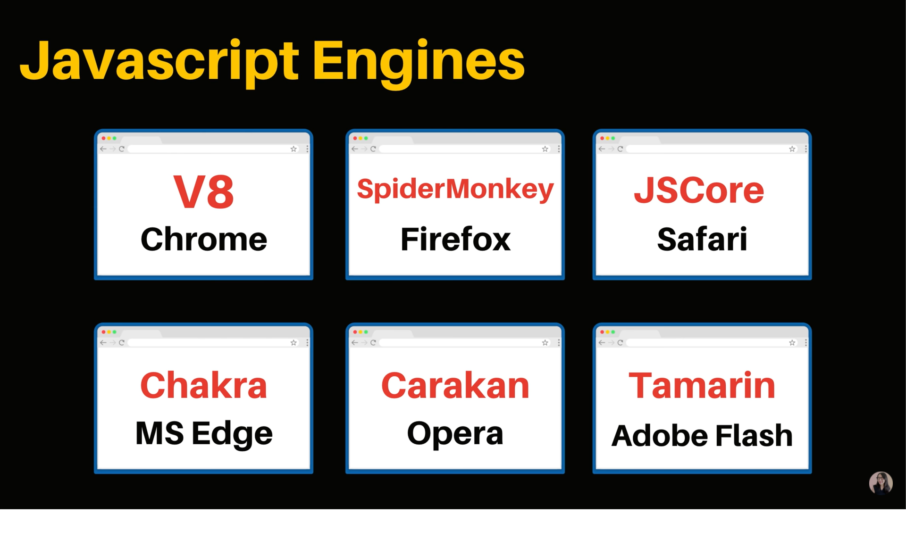

# Chapter 01

## 자바스크립트 배우기전 꼭 봐야할 영상 | 자바스크립트의 역사와 현재 그리고 미래 (JavaScript, ECMAScript, JQuery, Babel, Node.js)

> 이 챕터는 자바스크립트의 탄생 배경에 대해 다루고 있다. 
> 너무 지루한 부분이므로 간단한 설명으로 이 챕터를 마무리하겠다.

1. `JavaScript`는 `Netscape`사에서 처음 만들어졌고 그 뒤에 `마이크로소프트` 사에서 JavaScript를 비슷하게 따와 베낀 `Jscript`가 탄생하게 되었다. 그 뒤에 마이크로소프트 사는 `Internet Explorer`를 시장에 출시하게 되었고 시장 점유율 95%라는 독점을 하게 되었다. 그 덕분에 마이크로소프트는 더 이상 ECMAScript를 따르지 않게 되었고 자신들이 표준이라는 선언을 하게 된다. 때문에 ECAMScript는 2000년부터 업데이트 되지 않았다.

2. 2004년 `Mozilla`가 Firefox를 시장에 출시하면서 Netscape <-> Microsoft <-> Mozilla 의 치열한 3사 경쟁이 시작되었다. 때문에 개발자들은 여러 브라우저에서도 호환이 가능한 웹사이트를 만들어야 했고 이것이 개발자들의 고통 시발점이 되었다. 이 때문에 개발자들 사이에서 여러 강력한 커뮤니티가 생기게 되었고 더 이상 여러 웹사이트 때문에 고통받지 않도록 JQuery / Dojo / mootools와 같은 여러 라이브러리가 생기게 되었다.

3. 2008년 웹시장의 생태계를 바꾸는 괴물이 등장했다. 바로 구글에서 자바스크립트를 엄청 빠르게 동작시키는 엔진을 탑재한 크롬을 시장에 내놓게 된 것이다. 크롬의 등장으로 인해 3사는 더이상 다툴 수 없게 되었고 4사가 모여 표준안을 협상하게 되었다. 이렇게 탄생하게 된 것이 2009년에 나온 ECMAScript 5인 것이다. 그 뒤에 2015년 ECMAScript 6가 나오게 되면서 현재 쓰는 모든 자바스크립트 표준이 되었다. 이제 자바스크립트는 더 이상 불투명하게 움직이지 않는 잘 정착된 언어가 된 것이다. 덕분에 전에 사용했던 JQuery / Dojo / mootools과 같은 라이브러리를 사용하지 않고서도 이제는 웹 APIs를 통해 여러 웹사이트와도 호환이 가능하게 된 것이다.

4. 밑의 첨부사진은 각각의 브라우저마다 ECMAScript를 따라가는 다양한 엔진들이다. 
    
   크롬에서 사용되는 V8엔진은 NodeJS와 Electron에서도 많이 이용되어진다. 현재는 Microsoft사에서도 V8엔진으로 대체하면서 사용하면서 크롬과 같이 많은 것들을 할 수 있게 되었다.

5. 모든 사람들이 최신 JavaSciprt를 사용하고 최신 엔진을 사용하는 것은 아니다. 하지만 대부분의 개발자들은 최신 JavaScript를 사용하고 싶기 때문에 개발할때는 최신 JavaScript를 사용하며 배포할 때만 JavaSciprt transcomplier를 통해 최신 버전의 JavaScript를 ECMAScript 5나 6로 변환해서 만드는 `Babel`을 사용하게 되었다.

6. 이제 더이상 웹사이트만으로는 충분하지 않고 그렇기 때문에 현재 뜨고 있는 트렌드는 `SPA(Single Page Application)`, 바로 하나의 페이지에서 필요한 데이터만 받아서 업데이트하는 것이 유행이 되었다. 이것을 쉽게 해주는 것이 프레임워크 3대장 `React` + `Vue` + `Angular` + `Backbone` 같은 것들이 탄생하게 된 것이다.

7. 이제는 V8과 같은 강력한 엔진 덕분에 NodeJS가 탄생하여 백엔드에서 자바스크립트를 구현할 수 있으며 서버를 독자적으로 만들 수 있게 되었다. 또한 React Native를 통해 모바일 어플리케이션을 만들 수도 있으며 Electron을 통해 데스크탑 어플리케이션도 자바스크립트로 만들기가 가능해졌다. 웹 브라우저는 자바스크립트로 내장된 언어였는데 요즘에는 `Web Assembly`가 탄생하게 되면서 다양한 언어(C, C++, Rust, Go...)들을 통해 어플리케이션을 만드는 것이 가능해졌다. 이제는 자바스크립트의 가능성이 무궁무진해진 것이다.  

이 글은 [유튜브 드림코딩 by 엘리 채널](https://www.youtube.com/watch?v=wcsVjmHrUQg&list=PLv2d7VI9OotTVOL4QmPfvJWPJvkmv6h-2&index=1)을 통해 리뷰를 작성한 것이며 어떠한 상업적 목적으로도 사용되지 않았습니다. 추후 문제가 되는 점이 있으면 댓글을 통해 남겨주시면 수정하겠습니다 :)
