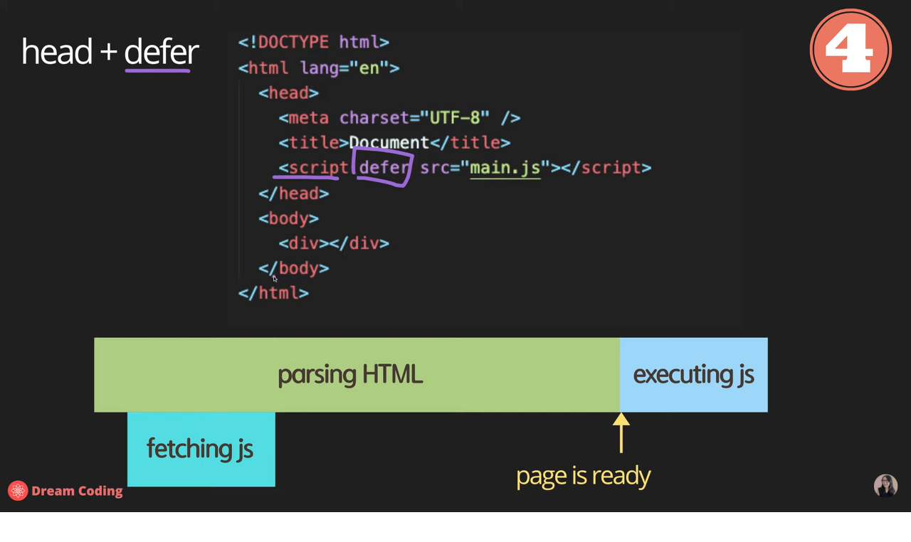

# Chapter 02

## 자바스크립트2. 콘솔에 출력, script async 와 defer의 차이점 및 앞으로 자바스크립트 공부 방향

1. html 파일에 js파일을 import하는 가장 효율적인 방법

   1. 먼저, head에 script를 추가하는 방법이다.  
       
      브라우저가 파일을 읽을 때 html css를 한줄한줄씩 읽으면서 DOM요소로 변환/분석하게 된다. 
      그런데 이렇게 html을 parsing하는 과정에서 head에 추가된 script를 만나면서 parsing하던 과정을 멈추게되고
      script를 fetching(다운)받아서 executing(실행)한 후에 나머지 html을 parsing하게 된다는 것이다. 
      이렇게 script를 추가하게 되면 생기는 단점은 script파일이 엄청 커지게 되면 그만큼 읽는데 시간이 걸리고 이렇게 되면 당연히 사용자가 페이지를 로딩하는데 시간이 오래 걸리게 된다. 
      따라서, head에 script를 추가하는 방식은 매우 좋지 못합니다. 

   2. body 끝부분에 script를 추가하는 방식이다.  
       
      아까와 다르게 html을 전부 parsing할 수 있으며 page가 로딩이 된 후 script가 fetch / execute가 될 수 있다. 
      이렇게 되면 사용자가 html을 빨리 받아올 수 있지만 만약에 페이지가 JavaScript에 굉장히 의존적이라면 사용자가 웹사이트의 전체적인 부분을 사용하기 위해서 script가 실행될 때까지 기다려야만 한다는 것이다. 

2. async vs defer

   1. header안에 async를 사용하여 script를 추가하는 방법이다.  
       
      html을 parsing하는 동시에 script를 다운받게 되고 다운이 완료되는 즉기 script를 실행한 후에 나머지html을 parsing하게 됩니다. 
      장점으로는 비동기식으로 진행되기 때문에 script를 다운받는 시간이 절약된다는 것이다. 하지만 단점으로는 html을 전부 parsing하기도 전에 script를 실행하기 때문에 DOM요소를 통해 JS가 HTML이나 CSS에 접근하는 것에 대해 아직 정의되지 않은 변수 등에 접근하게 됩니다. 

   2. defer  
       
      앞의 async와 매우 동일한 방식으로 async를 defer로 바꾼 형태이다. 
      이렇게 하면 html을 다운받는 동시에 script파일을 비동기적으로 다운받게 되고 html parsing이 끝나면 script가 실행되기 때문에 위에 3가지 방법을 통틀어 가장 좋은 방법이라고 할 수 있다. 

      async는 비동기적인 방식이다.  
       
      async를 사용하면 마치 병렬식으로 실행되기 때문에 먼저 읽어들인 파일을 차례로 실행하게 된다. 
      예를 들어 a script를 먼저 실행해야하는데 b script가 짧아서 먼저 다운되고 실행된다면 async는 좋지 않은 방법일 것이다.  
      defer은 비동기적이지만 순차적으로 실행된다.  

       
      async와 다르게 script를 정의해 준 순서대로 실행되는 장면입니다. 
      html, css, javascript를 잘 모르는 사람이 보아도 defer로 정의해준 script가 가장 로딩도 편하며 내가 원하는대로 순서를 지정해줄 수 있어서 좋은 방식이지 않을까요?  

3. 'use strict'

자바스크립트를 사용하면서 전혀 몰랐는데 script에 'use strict'를 추가하게 되면
보통 내가 선언하지 않은 변수나 바꾸면 안되는 type을 바꾸면서 에러가 뜨게 되는데(이래서 typescript를 써야하나봄) 
앞의 선언을 통해 이러한 비상식적인 것을 사전에 방지해 주는 역할을 하게 됩니다. 
만약 바닐라 자바스크립트를 사용한다면 'use strict'를 통해 쾌적한 코딩을 하시길 바랍니다ㅋ.ㅋ 

cf) 자바스크립트의 공식 사이트는 EcmaScript이다. 들어가보면 알겠지만 개발자가 보기에 매우 난해한 사이트이다. 
따라서 우리 개발자들이 쉽고 간편하게 사용할 수 있는 웹사이트는 developer.mozilla.org이다. 
굉장히 자세하게 나와있으며 예제까지 첨부되어있다. 한글번역도 되어있는 갓갓사이트;; 
w3schools는 노르웨이의 한 회사가 만든 사이트이며 공식사이트가 아니다. 또한 MDN이랑 비교해봤을 시 예제도 압도적으로 많으며 최신정보도 빠르게 업데이트되므로 MDN을 자주 애용하도록 하자!  

이 글은 [유튜브 드림코딩 by 엘리 채널](https://www.youtube.com/watch?v=tJieVCgGzhs&list=PLv2d7VI9OotTVOL4QmPfvJWPJvkmv6h-2&index=2)을 통해 리뷰를 작성한 것이며 어떠한 상업적 목적으로도 사용되지 않았습니다. 추후 문제가 되는 점이 있으면 댓글을 통해 남겨주시면 수정하겠습니다 :)
