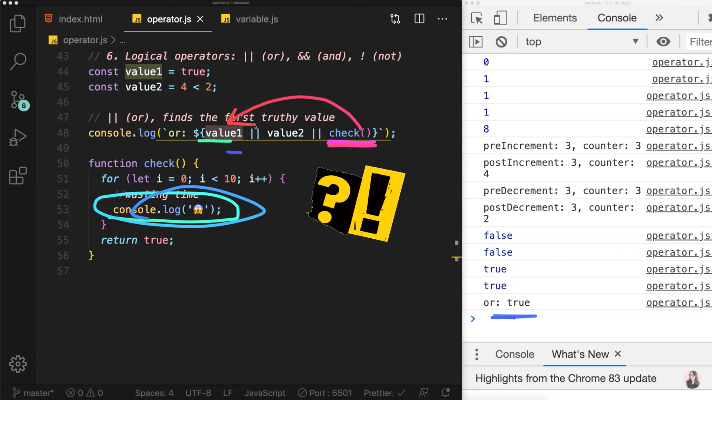
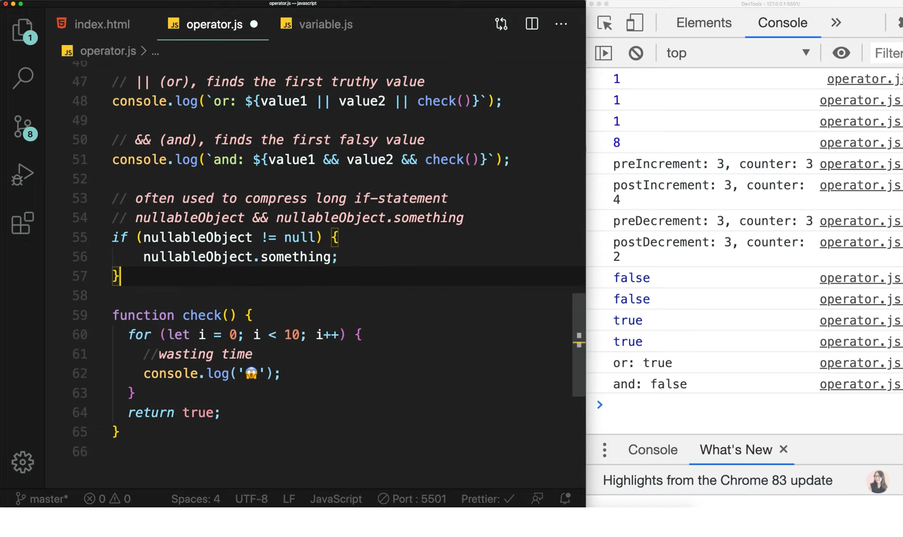
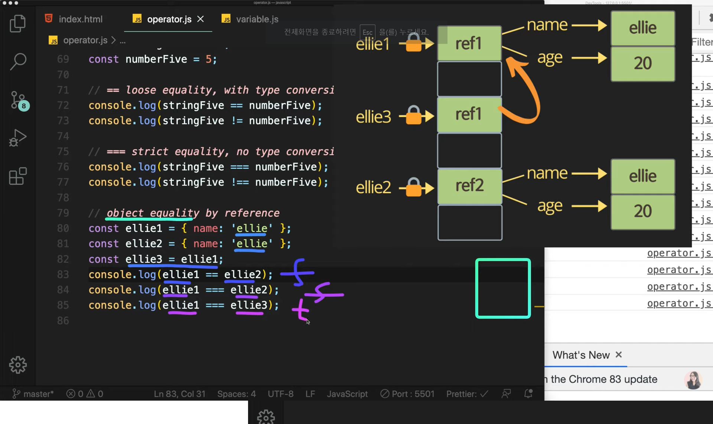
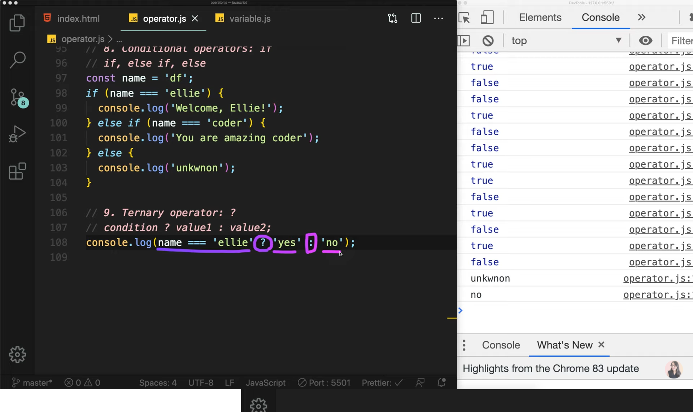
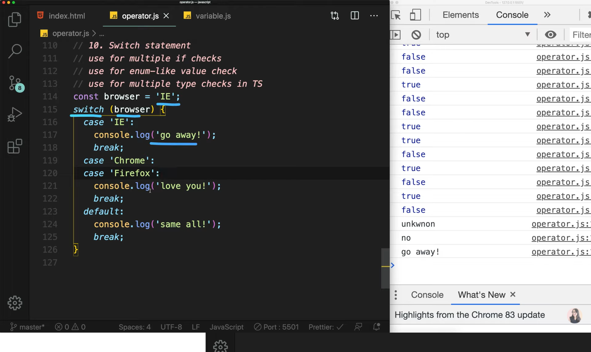
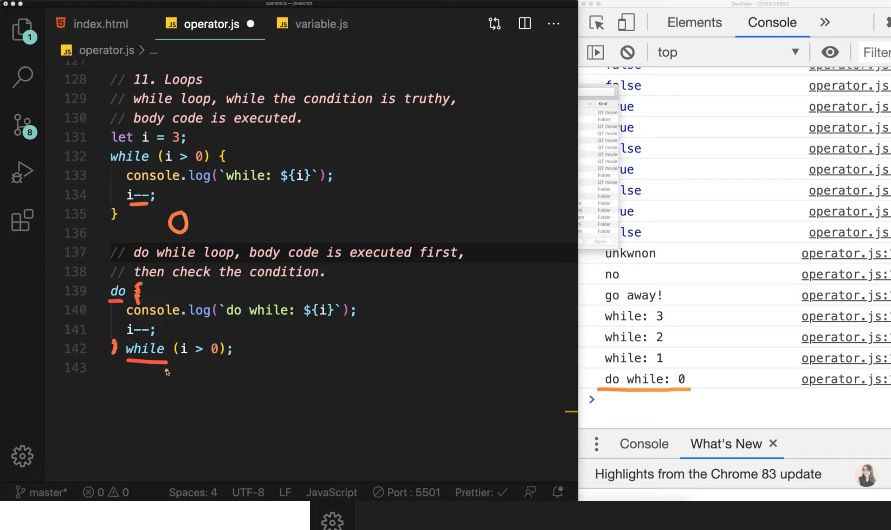
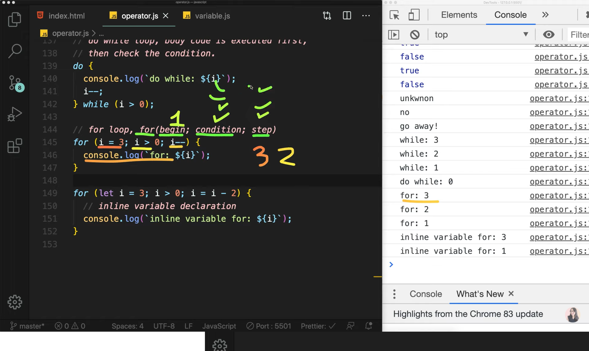

# Chapter 04

## 자바스크립트 4. 코딩의 기본 operator, if, for loop 코드리뷰 팁 | 프론트엔드 개발자 입문편 (JavaScript ES6)

1. String concatenation

   ```
   console.log('my' + 'cat');
   console.log('1' + 2);
   console.log(`string literals: 1 + 2 = ${1 + 2}`);

   ```

2. Numeric operators

   ```
   console.log(1 + 1); // add
   console.log(1 - 1); // substract
   console.log(1 / 1); // divide
   console.log(1 * 1); // multiply
   console.log(1 % 1); // remainder
   console.log(1 ** 1); // exponentiation

   ```

3. Increment and decrement operators

   ```
   let counter = 2;
   const preIncrement = ++counter; => 이것은 아래와 결과가 같다.
   // counter = counter + 1;
   // preIncrement = counter;

   const preIncrement = counter++; => 이것은 아래와 결과가 같다.
   // preIncrement = counter;
   // counter = counter + 1;

   Decrement 과정도 위와 같다.
   ```

4. Assignment operators

   ```
   let x = 3;
   let y = 6;

   x += y; // x = x + y;
   x -= y;
   x *= y;
   x /= y;
   ```

5. Comparison operators

   ```
   console.log(10 < 6); // less than
   console.log(10 <= 6); // less than or equal
   console.log(10 > 6); // greater than
   console.log(10 >= 6); // greater than or equal
   ```

6. Logical operators: ||(or), &&(and), !(not)

   1. ||(or)
      <br>
      중요한 점은 or은 하나만 true여도 결과값이 true가 되기 때문에 앞에서 true가 나오면 뒤에 코드는 신경쓰지 않게된다.<br>따라서 check()와 같은 복잡한 함수를 뒤에 뒤에 둬야 마지막에 호출하므로 효율적이다.<br>

   2. &&(and)
      <br>
      and도 역시 하나만 false여도 결과값이 false가 되기 때문에 앞에서 false가 나오면 뒤에 코드는 신경쓰지 않게 된다.<br>이것도 마찬가지로 복잡한 로직함수는 뒤에 두는 것이 효율적이다.<br>and operator는 null object인지 체크하는 방법으로 많이 사용되어진다.<br>첨부사진을 활용하기 바랍니다 :)

   3. !(not)

      ```
      console.log(value1);

      true
      결과값이 반대로 나오게 된다.
      ```

7. Equality operator

   ```
   const stringFive = '5';
   const numberFive = 5;

   // == loose equality, with type conversion
   (타입을 변경해서 검사)
   console.log(stringFive == numberFive);
   console.log(stringFive != numberFive);

   // === strict equality, with no type conversion
   (타입을 변경하지 않고 검사)
   console.log(stringFive === numberFive);
   console.log(stringFive !== numberFive);
   ```

   <br>
   Equlity operator는 object를 검사할 때도 많이 쓰인다.<br>
   위의 첨부사진에서 맨 아래 3개의 console.log의 값은 어떻게 나올까?<br>결과는 각각<br>false<br>false<br>true<br>로 나오게 된다.<br>
   ellie1과 ellie2는 똑같은 값이 들어가 있는 object이지만 1과 2에는 사실 각각 다른 ref가 들어가 있으며 서로 다른 ref를 가리키게 됩니다.<br>또한 ellie3은 ellie1의 ref를 할당했기 때문에 똑같은 ref를 가지게 되기 때문에 위와 같은 결과가 나오게 됩니다.<br>

   ```
   연습 타임!
   console.log(0 == false); // true
   console.log(0 === false); // false
   console.log("" == false); // true
   console.log("" === false); // false
   console.log(null == undefined); // true
   console.log(null === undefined); // false
   ```

8. Conditional operator

   <br>
   아주 많이 쓰이는 if문이다.<br>if문이 맞으면 실행하고 아니면 else if문이 실행되며 else if 문도 아니면 마지막으로 else를 실행한다.<br>또한 간단한 식이면 if 대신 ?를 사용하여 한 줄로 표현할 수 있다.<br>true면 앞의 식이 실행되고 false면 뒤의 식이 실행된다.<br>?문은 식이 길어지면 가독성이 떨어지기 때문에 if나 switch문을 사용하길 바란다.<br>

9. Switch operator

   <br>
   if문이 길어지면 switch문이 훨씬 더 가독성이 좋다.<br>
   똑같은 문장이 실행되면 위의 첨부사진과 같이 한개로 묶어줄 수가 있다.<br>

10. While & Do while operator

    <br>
    while문이든 do while문이든 둘 다 조건식이 false가 될 때까지 실행시킨다.<br>다만 do while문은 블럭을 먼저 실행 시킨 후 조건식을 확인하므로 블럭을 먼저 실행해야하는 입장에서만 사용한다.<br>

11. For operator

    <br>
    for문은 begin, condition, step가 존재하는데 begin은 한번만 실행되고 condition이 끝나면 step가 실행되며 끝날때까지 반복된다.
    <br>또한 begin에서 let으로 변수가 할당해서 사용할 수도 있다.<br><br>

    <br>
    for문을 중첩하는 것은 cpu에 효율이 좋지 않으므로 피하는 것이 좋다.<br>마지막으로 첨부사진의 퀴즈를 풀어보시길 바랍니다.<br>

    ```
    q1

    for(let i = 0; i < 11; i++) {
        if(i % 2 !== 0) {
            continue;
        }
            console.log(`q1 = ${i}`)
    }

    q2

    for(let i = 0; i < 11; i++) {
        if(i > 8) {
            break;
        }
            console.log(`q2 = ${i}`)
    }
    ```

    이번 강의는 여기서 마무리입니다 :)<br>

이 글은 [유튜브 드림코딩 by 엘리 채널](https://www.youtube.com/watch?v=YBjufjBaxHo&list=PLv2d7VI9OotTVOL4QmPfvJWPJvkmv6h-2&index=4)을 통해 리뷰를 작성한 것이며 어떠한 상업적 목적으로도 사용되지 않았습니다. 추후 문제가 되는 점을 발견하시면 댓글을 통해 남겨주시는대로 수정하겠습니다 :)
