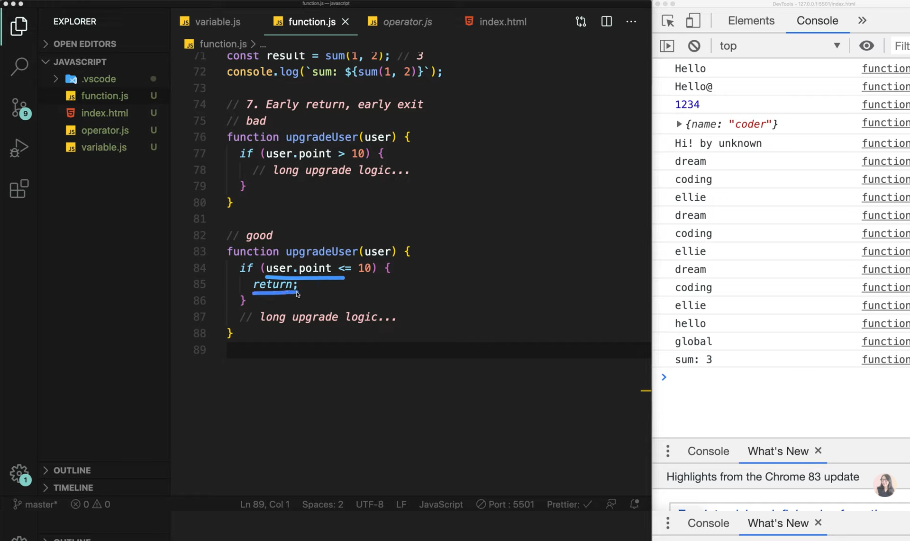
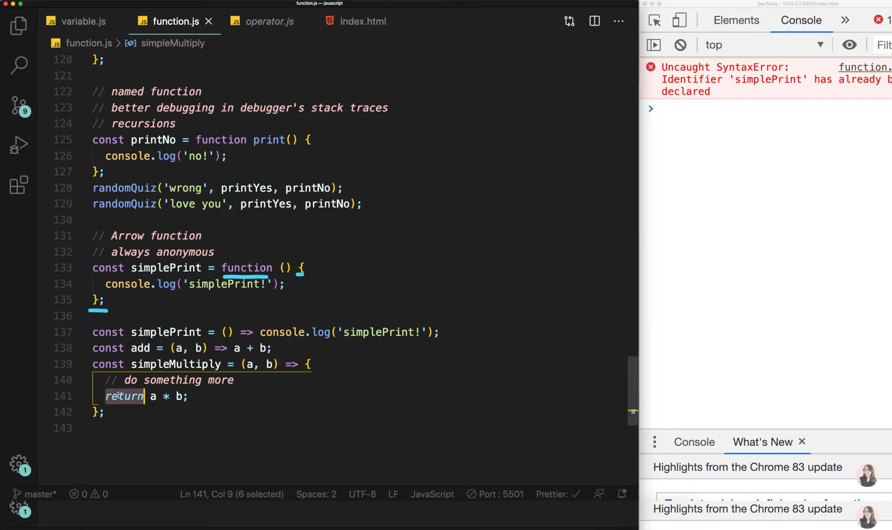

# Chapter 05

## 자바스크립트 5. Arrow Function은 무엇인가? 함수의 선언과 표현 | 프론트엔드 개발자 입문편(JavaScript ES6)

우리가 매일매일 사용하는 프로그램들은 여러가지 기능들을 갖고 있으며 각각 저마다의 고유 기능을 가지고 있습니다.<br>이렇게 각각의 고유 기능을 수행하는 함수(function)들이 있는데 자바스크립트와 같이 절차적인 언어에서는 함수가 프로그램에서 굉장히 중요한 역할을 하게 됩니다.<br>그래서 때로는 sub-program이라고 불리기도 한다.<br><br>

<br><br>
어떤 언어에서든지 function은 input(parameter)들을 받아서 output(reuturn)을 반환하는 것이 목적이다.<br>그렇기 때문에 function은 input을 잘 받아서 output을 반환하고 함수의 이름을 잘 정하는 것 역시 중요합니다.<br>

1. Function

   <br>

   - fundamental building block in the program<br>
     (프로그램에서 중요한 기본적인 빌딩 블록이다.)<br>
   - subprogram can be used multiple items<br>
     (서브 프로그램이라 불리우며 여러번 재사용 되기도 한다.)<br>
   - performs a task or calculates a value<br>
     (어떤 것을 개선하거나 하나의 값을 계산하기 위해 사용되기도함!)<br>

   1. Function declaration<br>
      function name(params...){body... return;}이라는 구조를 가진다.<br>여기서 중요한 점은 하나의 함수는 한가지의 일만 하도록 만들어야 한다.<br>
      또한 자바스크립트에서 함수는 객체의 일종이다.<br>

   2. Parameters<br>

   - premitive parameters: passed by value<br>
   - object parameters: passedby reference<br>

   3. Default parameters (added in ES6)<br>

      ```
      function showMessage(message, from = 'unknown') {
          console.log(`${message} by ${from}`);
      }
      showMessage('Hi');

      result
      hi by unknown
      파라미터를 못받을 경우를 대비해 Default parameter값을 정의해        주면 위와 같이 default값으로 매겨진다.
      ```

   4. Rest parameters<br>

      ```
      function printAll(...args) {
          for(let i = 0; i < args.length; i++) {
              console.log(args[i]);
          }

          for(const arg of args) {
              console.log(arg);
          }
      }
      printAll('dream', 'coding', 'ellie');

      result
      dream
      coding
      ellie
      ...을 통해 parameter을 받게 되면 rest parameters라고 불리우며       배열 형태로 값을 받게 된다.
      또한 이것은 for of문을 통해서도 똑같이 작용하는 것이 가능하다.
      ```

   5. Local scope<br>

      <br><br>
      밖에서는 안을 볼 수 없고 안에서만 밖을 볼 수 있다.<br>
      지역변수와 글로벌변수는 함수안에서 사용가능하지만 지역변수는 함수 바깥에서 사용할 수 없듯이 말이다..<br>

   6. Return<br>

      <br><br>
      함수는 모두 return을 가지게 되어있다. 만약에 return이 없는 함수들은 return undefined가 생략되어 있다고 생각하면 된다.<br>

   7. Early return<br>

      <br><br>
      Early return이란 조건문이 맞지않으면 빠르게 return 하라는 뜻으로 캡처에서 위의 함수처럼 조건이 맞으면 함수가 실행하게 하는 것보다<br>조건이 맞지 않는 것을 return으로 반환해 빠르게 종료하고 그 뒤에 조건에 맞는 식을 실행하게 하는 것이다.<br>

2. Function expression

   <br><br>
   저번 강의에서 First class function이란 다른 변수들과 마찬가지로 변수에 할당이 가능하고<br>함수의 파라미터에 전달이 되며<br>함수의 리턴 값으로도 사용된다고 설명했다.<br>이것을 가능하게 하는 것이 Function expression이다.<br>

   함수를 선언함과 동시에 변수에 할당하는 것을 Function expression이라고 한다.<br>Function declaration <-> Function expression의 차이점은<br>

   > Function expression은 함수가 할당된 다음부터 사용할 수 있다.<br>
   > Function declaration은 `hoist`가 가능해 함수가 맨 위에 선언되게 된다.

3. Callback function using function expression

   <br><br>
   함수의 파라미터로 함수가 들어가게 되는 것을 Callback Function이라고 한다.<br>또한 캡처와 같이 함수에 이름이 없는 경우를 annoymous function(익명 함수)라고 한다.<br>반대로 이름이 있는 경우를 named function이라고 한다.<br>마지막으로 함수가 자기 자신 함수를 호출하는 것을 recursion이라고 한다.<br>recursion은 계속해서 호출되니 정말 필요할 때 아니면 사용하지 말자.<br>

4. Arrow function

   <br><br>
   기존의 함수 선언 방식과 다르게 화살표를 사용해 간결하게 함수를 선언할 수 있다.<br>무조건 사용하자..

5. IIFE(Immediately Invoked Function expression)

   <br><br>
   다음과 같이 함수를 바로 실행시키고 싶으면 함수를 ()로 둘러싸서 바로 실행시킬 수 있다.<br>많이 쓰이는 방법은 아닙니다.<br>

   이번 강의는 여기서 마무리입니다 :)<br>

이 글은 [유튜브 드림코딩 by 엘리 채널](https://www.youtube.com/watch?v=tJieVCgGzhs&list=PLv2d7VI9OotTVOL4QmPfvJWPJvkmv6h-2&index=5)을 통해 리뷰를 작성한 것이며 어떠한 상업적 목적으로도 사용되지 않았습니다. 추후 문제가 되는 점이 있으면 댓글을 통해 남겨주시면 수정하겠습니다 :)
