# Chapter 06

## 자바스크립트 6. 클래스와 오브젝트의 차이점(class vs object), 객체지향 언어 클래스 정리 | 프론트엔드 개발자 입문편 (JavaScript ES6)

---

클래스란?<br><br>

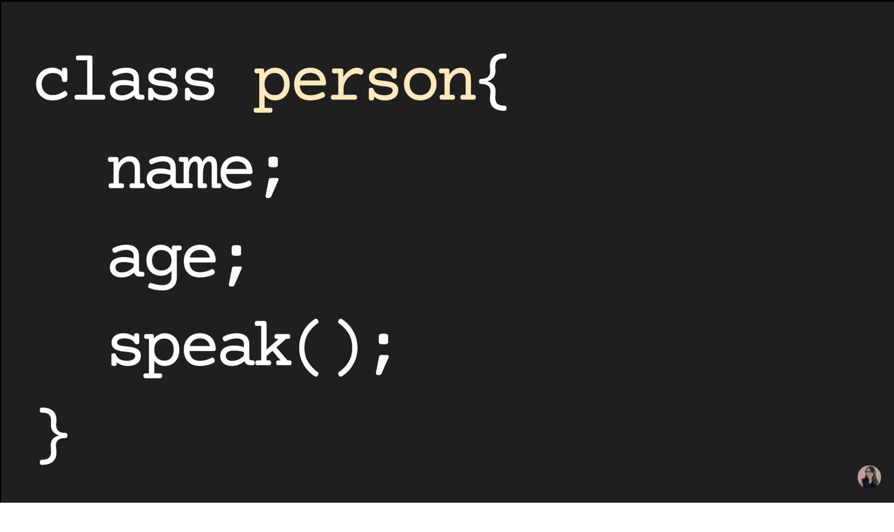<br><br>

조금 더 연관있는 데이터들을 한군데 묶어놓는 컨테이너 같은 존재이다.<br>위와 같이 class에는 name & age와 같은 property(field)도 들어있고,<br>speak()와 같은 function(method)도 들어있다.<br>이렇게 관련있는 변수들이나 함수들을 묶어놓은 녀석들을 `Class`라고 한다.<br>

클래스 내에서도 내부적으로 보이는 변수와 밖에서 보일 수 있는 변수들을 나누어서 이런것들을 `인캡슐레이션` 또는 `캡슐화`라고도 한다.<br>또한 클래스를 이용해 `상속`과 `다양성`이 일어날 수 있다.<br>이러한 모든 것들을 가능케 하는 것이 `객체지향 프로그래밍`이다.<br><br>

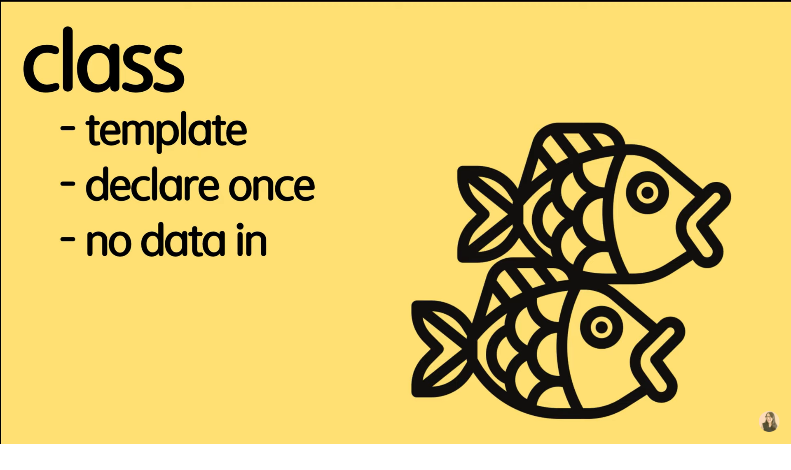<br><br>
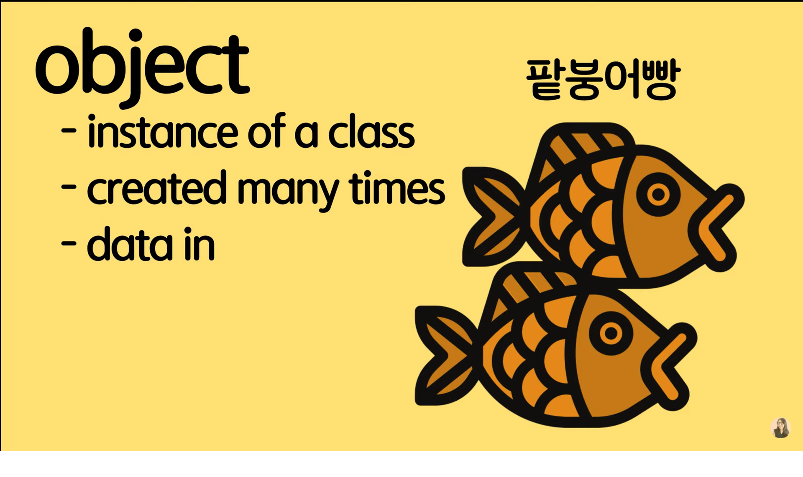<br><br>

그림을 보는 것과 같이 `Class(클래스)`는 붕어빵을 만들 수 있는 큰 틀이다.<br>클래스 자체에는 데이터가 들어있지 않고 Template(틀)만 선언하는 것이다.<br>이 클래스라는 틀을 이용해 실제 데이터를 만드는것이 바로 `Object(객체)`이다.<br>클래스는 데이터가 들어있지 않아 메모리에 올라가지 않지만 객체는 데이터가 들어있어 메모리 상에 올라가게 된다.<br>

클래스는 ES6이후에 도입된 것으로 그 전에는 클래스를 사용하지 않고 오브젝트를 사용해 바로 만들 수 있었다.<br>

1. Class declarations

   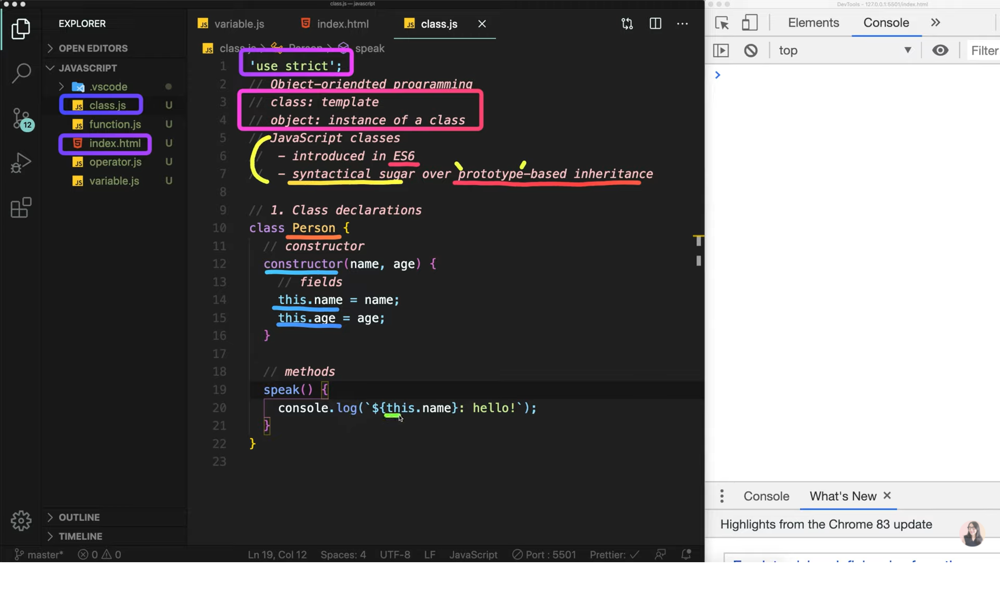<br><br>
   person이라는 클래스를 선언하고 constructor라는 생성자를 통해 나중에 객체를 만들 때 필요한 데이터를 전달합니다.<br>위의 그림은 2가지의 fields와 하나의 method로 구성되어 있다.<br>

   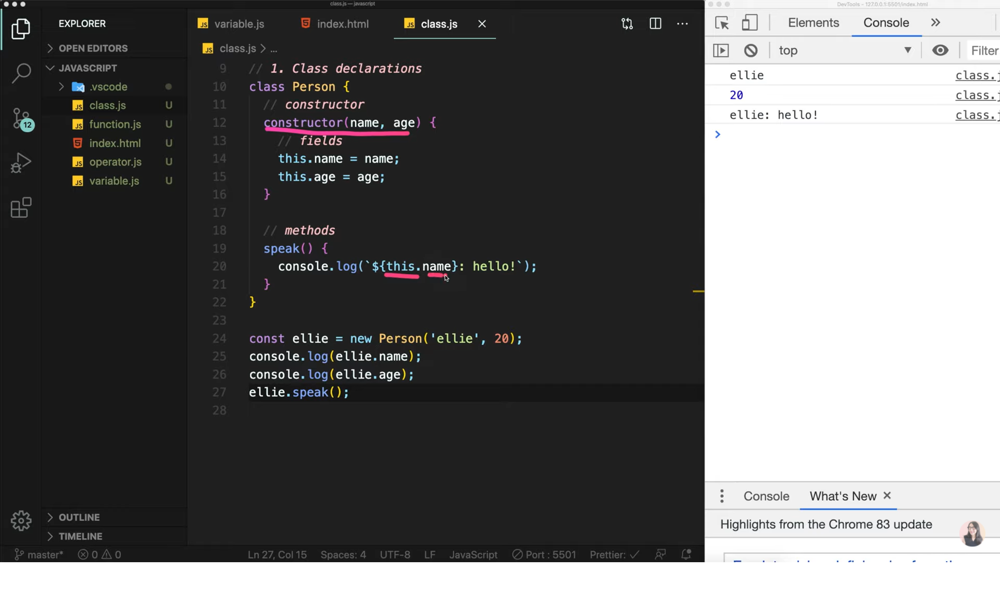<br><br>
   클래스를 통해 새로운 오브젝트를 만드는 방법은 `new`라는 키워드를 사용합니다.<br>또한 `this`는 생성된 오브젝트를 가리켜 speak()함수를 콘솔로그 찍어보면 this.name이 ellie가 나오는 것을 알 수 있다.<br>

2. Getter & Setter

   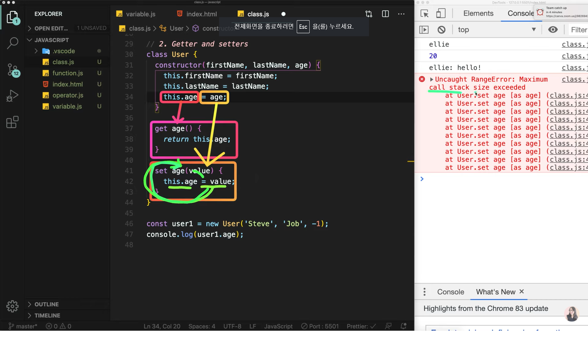<br><br>
   클래스를 사용하는 사용자가 위와 같이 'age'를 '-1'이라고 잘못 설정해도 우리가 좀 더 방어적인 자세로 만들어줄 수 있는 것이 `getter`와 `setter`이다.<br>'-1'이라는 값은 말이 안되기 때문에 `get`이라는 메서드를 통해 값을 리턴하고 `set'이라는 키워드를 통해 값을 설정할 수 있다.<br>따라서 get에선 return age를 통해 값을 리턴하고 set에서는 새로운 value를 무조건 받아와야 한다.<br>

   getter를 설정하는 순간 클래스 생성자의 'this.age'는 새로 생긴 객체를 가리키는 것이 아닌 getter를 가리키게 된다.<br>또한 setter를 설정하면 바로 객체 값에 할당해주는 것이 아닌 setter를 가리키게(호출하게) 된다.<br>즉, getter와 setter가 설정되어 있으면 클래스로 객체를 생성할 때 바로 생성하는 것이 아니라 getter와 setter를 들렸다가 가는 것이다.<br>

   그런데 setter 문장을 보면 this.age = age 를 하게 됨녀서 또 setter를 호출하게 된다.<br>때문에 setter를 무한으로 호출하게 되고 이것으로 인해 콜스택이 다 찼다는 에러가 뜨게 된다.<br>따라서 setter와 getter에서 쓰여지는 변수의 이름을 조금 바꾸는 것이 룰이다.<br>보통 this.\_age 이런 식으로 만드는 듯 하다.<br><br>

   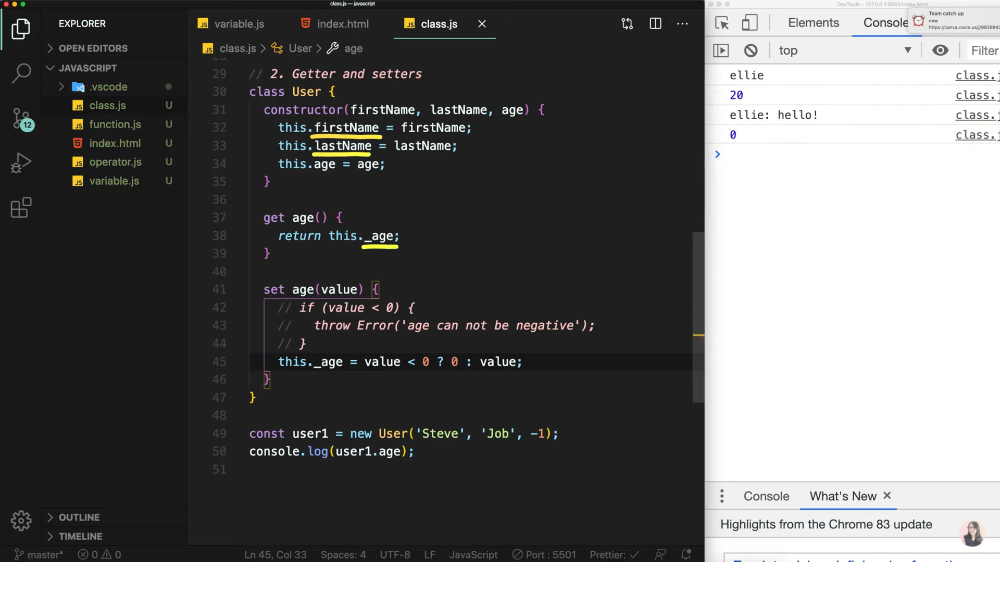<br><br>
   따라서 User라는 클래스 안에는 총 3개의 field가 있는데 firstName / lastName / \_age 총 3개이다.<br>getter와 setter는 간단하게 생각하면 된다. 원래 생성하려던 객체를 사용자가 바보같이 만들 수 있기 때문에 그 실수를 미리 방지하기 위해서 바로 메모리 위에 올라가 수 있는 데이터 객체를 만드는 것이 아니라 getter와 setter를 들려서 한 번 검사하고 데이터 객체를 만드는 것이라고 생각하자!<br>

3. Public & Private

   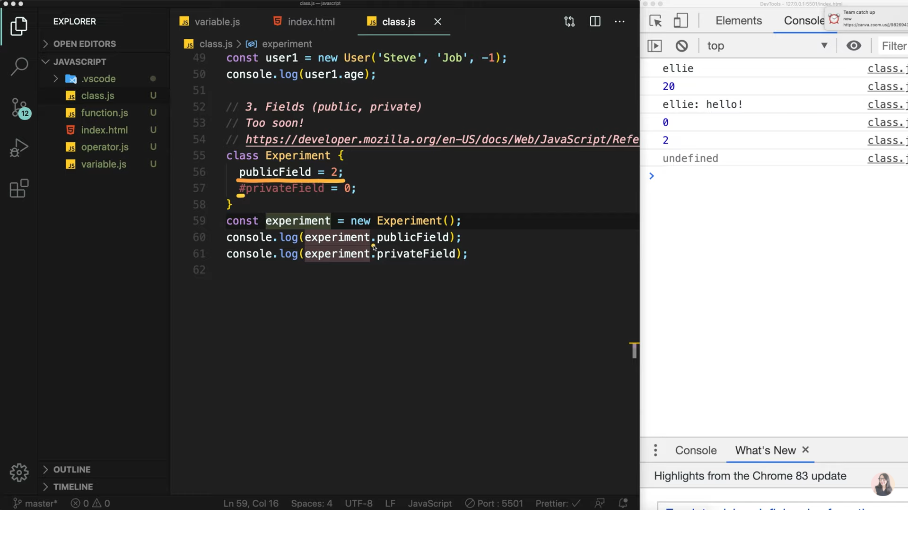<br><br>
   Public과 Private는 너무 최근데 추가되어서 많은 자바스크립트 개발자가 사용하고 있지는 않다.<br>생성자를 사용하지 않고 만든 field들 중에 그냥 사용한 것이 `Public` <-> 해시기호를 붙이게 되면 `Private`이다.<br>Private는 클래스 내부에서만 값이 보여지고 접근 가능하며 변경이 가능하다. 하지만 반대로 클래스 외부에서는 값을 읽을수도 접근할 수도 변경할 수도 없다.<br>

4. Static
   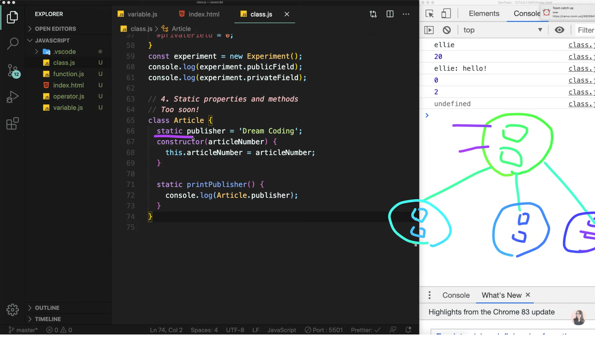<br><br>
   Static은 클래스 자체에 부여된 것으로 예를들어 위와 같이 객체를 생성하고 publisher(field)와 printPublisher()를 객체에서 호출해도 사용할 수가 없다.<br>반대로 Article.publisher or Article.printPublisher()를 호출하면 사용할 수가 있다.<br>이것은 객체가 누구든 상관없이 공통적으로 사용되어진다면 추가하는 것이 좋아보인다.<br>타입스크립트에서 많이 사용되어 진다고 한다 :)<br>

5. Inheritance

   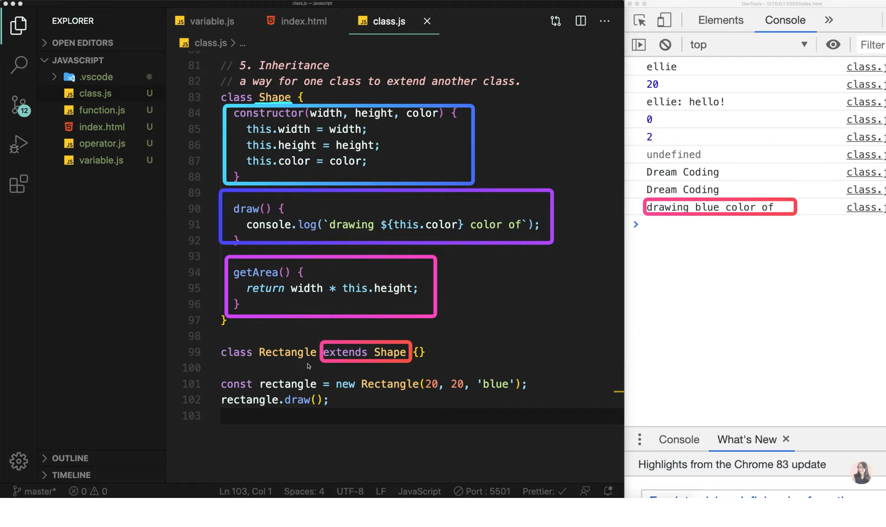<br><br>
   네모 동그라미 세모 등은 모두 width & height & color를 가지고 있다.<br>이렇게 공통된 속성들을 묶어놓은 클래스를 미리 만들어놓으면 나중에 3개를 일일히 따로 수정해야할 필요 없이 공통된 클래스 하나만 수정할 수 있어 유지보수에도 좋다.<br>따라서 Shape라는 공통된 클래스를 만들고 네모에만 해당하는 클래스를 만들고 싶다면<br>위의 첨부사진과 같이 class Rectangle extends Shape{}를 통해 상속 시켜주어 네모에 해당하는 부위만 따로 만들어줄 수 있다.<br>따라서 rectangle은 Shape 클래스에 상속되었기 때문에 Shape 클래스의 field나 method를 사용할 수 있게 된다.<br>

6. Diversity

   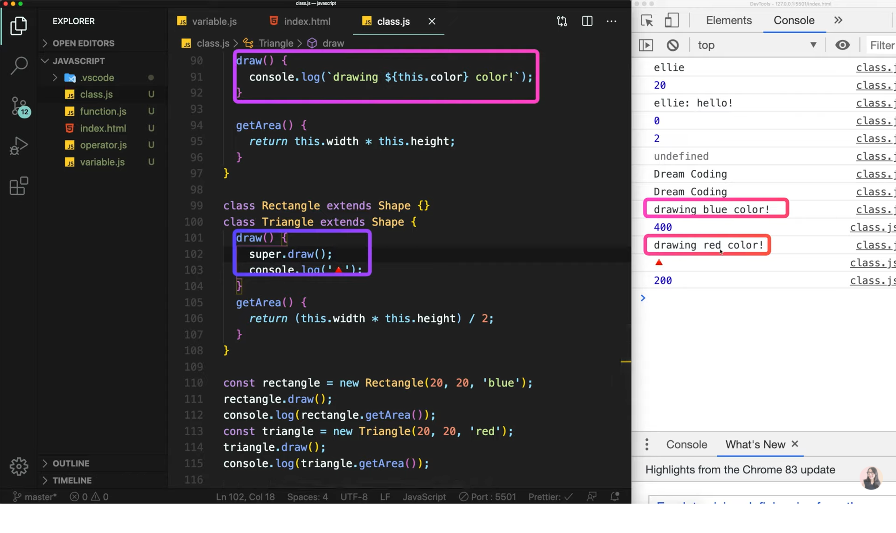<br><br>
   Shape이란 공통된 클래스를 만들었지만 모든 도형의 넓이를 구하는 방법이 다 똑같지 않다.<br>예를 들어 사각형은 가로x세로 이지만 삼각형은 가로x세로/2이므로 서로 다르기 때문에 삼각형 클래스 내에서 새로 정의 해줘야한다.<br>이것을 `다양성`이라고 하며 Triangle클래스 내에서 Shape클래스의 getArea()메서드를 다시 재정의해서 사용할 수 있는데 이것을 `overrride`라고 한다.<br>override를 하게되면 부모의 draw메서드는 사용되어지지 않는 것을 콘솔로그를 통해 확인할 수 있는데 super.draw()메서드를 통해 부모의 draw()메서드도 같이 출력되는 것을 확인할 수 있다.<br>

7. Instanceof

   ```
   instanceof는 앞의 변수가 뒤의 클래스의 객체가 맞는지 확인해주는 역할을 한다.

   console.log(rectangle instanceof Rectangle); // true
   console.log(triangle instanceof Rectangle); // false
   console.log(triangle instanceof Triangle); // ture
   console.log(triangle instanceof Shape); // true
   console.log(triangle instanceof Object); // true
   모든 자바스크립트 클래스는 객체에서 상속받았다.
   ```

이번 강의는 여기서 마무리 입니다:)<br><br>
이 글은 [유튜브 드림코딩 by 엘리 채널](https://www.youtube.com/watch?v=tJieVCgGzhs&list=PLv2d7VI9OotTVOL4QmPfvJWPJvkmv6h-2&index=6)을 통해 리뷰를 작성한 것이며 어떠한 상업적 목적으로도 사용되지 않았습니다. 추후 문제가 되는 점이 있으면 댓글을 통해 남겨주시면 수정하겠습니다 :)
