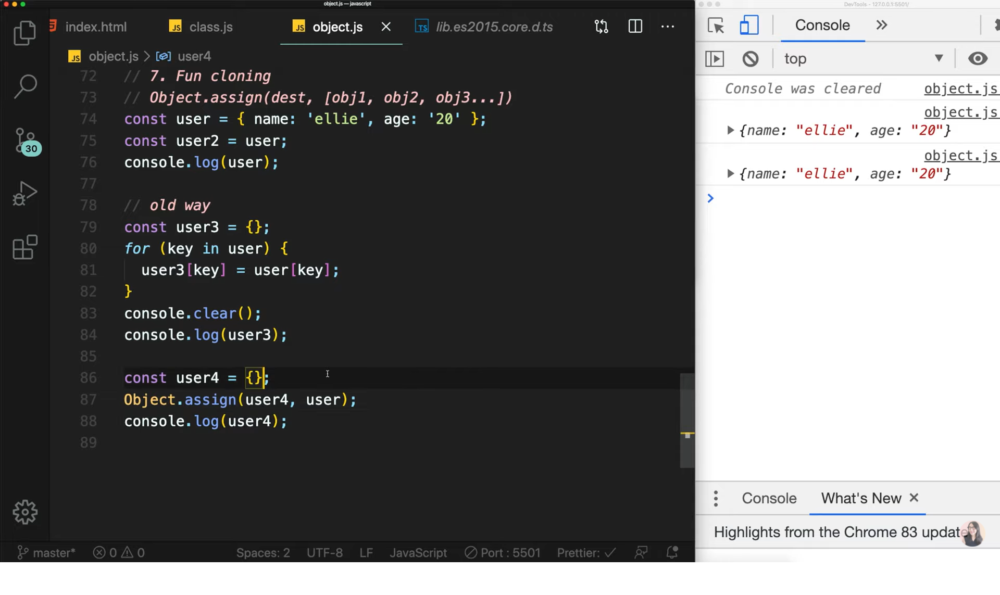

# Chapter 07

## 자바스크립트 7. 오브젝트 넌 뭐니? | 프론트엔드 개발자 입문편 (JavaScript ES6)

---

Object란?<br><br>
one of the JavaScript data types.<br>
a collection of related data and/or functionallity<br>
Nearly all objects in JavaScript are instance of Object<br>
Object = { key : value };<br><br>

1. Literals and Properties<br>
   변수는 하나당 값 하나만 담을 수 있게 되어있다.<br>그래서 예를 들어 변수를 사용하려고 하면 하나하나씩 일일이 다 불러와야 한다.<br>객체를 생성하게 되면 더 이상 하나하나씩 써주는 번거로움이 아니라 객체 하나만 불러와서 필요한 부분만 사용하면 되므로 매번 copy & paste 하는 수고로움을 덜 수 있다.<br><br>
   객체를 만드는 방법은<br>`1️⃣컬리 브라켓{}을 사용해서 만드는 방법` -> 'object literal' syntax<br>`2️⃣클래스를 통해 new키워드로 만드는 방법` -> 'object constructor' syntax<br>이 있다.<br><br>

   또한 자바스크립트는 Dynamically type language이기 때문에 선언하지 않아도 중간에 변수를 추가하거나 삭제하는 것이 가능하다.<br>

   ```
   ellie.hasJob = true;
   console.log(ellie.hasJob);

   delete ellie.hasJob;
   console.log(ellie.hasJob);

   result
   true
   undefined
   ```

2. Computed Properties<br>

   ```
   console.log(ellie.name);
   console.log(ellie['name']);
   ```

   객체의 프로퍼티에 접근할 때 `.(dot)`을 이용해 접근이 가능하다.<br>또 다른 방법은 ['property']와 같이 property를 명시해주는 것이다. 이 방법을 Computed Properties라고 한다.<br>중요한 점은 배열 안에 항상 String 타입으로 명시해주어야 확인이 가능하다.<br>Computed Properties 역시 중간에 변수를 추가하거나 삭제하는 것이 가능함.<br>

3. Property value shorthand

   <br><br>
   객체를 생성할 때 위와 같이 person1, person2 ....<br>하나하나씩 새로 만들어주는 것은 매우 어려운 일이다. 천개 만들어야 된다고 생각해보라.<br>그래서 위와 같이 makePerson함수를 통해 똑같이 객체를 만드는 방법이 있다.<br>그런데 위 방법이 어디서 많이 본 방법과 동일하다.<br>클래스를 통해서 틀에서 찍어내는 방법과 많이 비슷하지 않나요?<br>이 방법이 바로 클래스가 나오기 이전에 사용하던 Template(틀)입니다.<br>

4. Constructor function

   <br><br>
   그래서 함수로 객체를 만들때는 보통 makePerson과 같이 함수명을 짓지 않고,<br>앞의 문자를 대문자로 시작해 'Person'처럼 만드는 것이 룰입니다.<br>또한 클래스에서 사용하듯이 return을 통해 반환하지 않고 this를 사용해 데이터를 만들며 주석무너럼 this = {}와 return this;가 생략되어 있는 것 입니다.<br>함수를 호출할 때 new Person처럼 new키워드를 사용해 호출합니다.<br>

5. In operator: property existance check( key in obj )<br>

   ```
   console.log(name in ellie);
   console.log(age in ellie);
   console.log(random in ellie);

   result

   true
   true
   false
   ```

6. For..in vs For..of<br>

   ```
   for (key in obj) {
       console.log(key);
   }

   result

   name
   age
   hasJob
   obj안에 있는 모든 키들을 맨 처음부터 하나씩 출력하게 됨
   ```

   ```
   const array = [1, 2, 4, 5]
   for (value of array) {
       console.log(value);
   }

   result

   1
   2
   4
   5
   for of는 for in과 같이 객체가 아닌 배열과 같이 유한한 친구들에게 사용할 수 있다.
   ```

7. Fun Cloning

   <br><br>
   사진과 같이 user라는 객체를 만들고 user2가 user를 참조하게 만들었다.<br>여기서 user2.name = 'coder'이라고 바꾸게 되면 user.name은 어떻게 되어있을까?<br>user2의 name을 바꿨지만 user의 name도 'coder'로 변경되어 있는 것을 볼 수 있다.<br>그 이유는 user2가 user과 같은 똑같은 ref를 가리키고 있기 때문이다.<br><br>

   그렇다면 이렇게 user2가 user를 참조하지 않고 똑같은 ref를 복사하는 방법은 없을까?<br>예전에 쓰던 낡은 방법은 바로 for..in을 통해 객체를 복사하는 방법이 있었지만<br>지금은 모든 객체는 Object에 상속되어 있으므로 Object.assign()메서드를 통해 target을 source로 복사시키는 것이 가능하다.<br>assing메서드가 궁금하다면 mdn문서를 찾아봐도 되고 윈도우 유저라면 ctrl을 누르고 함수를 클릭하면(맥 유저는 command + 함수클릭) 정의된 곳으로 이동할 수 있다.<br>

현재 자바스크립트에서는 클래스보단 객체를 더 많이 쓰고 있다고 합니다.<br>하지만 타입스크립트에서는 객체지향프로그래밍에 관한 개념이 중요해지면서 클래스를 많이 이용한다고 하니 잘 이해해 두는 것이 좋을 것 같네요~<br><br>
이번 강의는 여기서 마무리 입니다:)<br><br>
이 글은 [유튜브 드림코딩 by 엘리 채널](https://www.youtube.com/watch?v=tJieVCgGzhs&list=PLv2d7VI9OotTVOL4QmPfvJWPJvkmv6h-2&index=7)을 통해 리뷰를 작성한 것이며 어떠한 상업적 목적으로도 사용되지 않았습니다. 추후 문제가 되는 점이 있으면 댓글을 통해 남겨주시면 수정하겠습니다 :)
