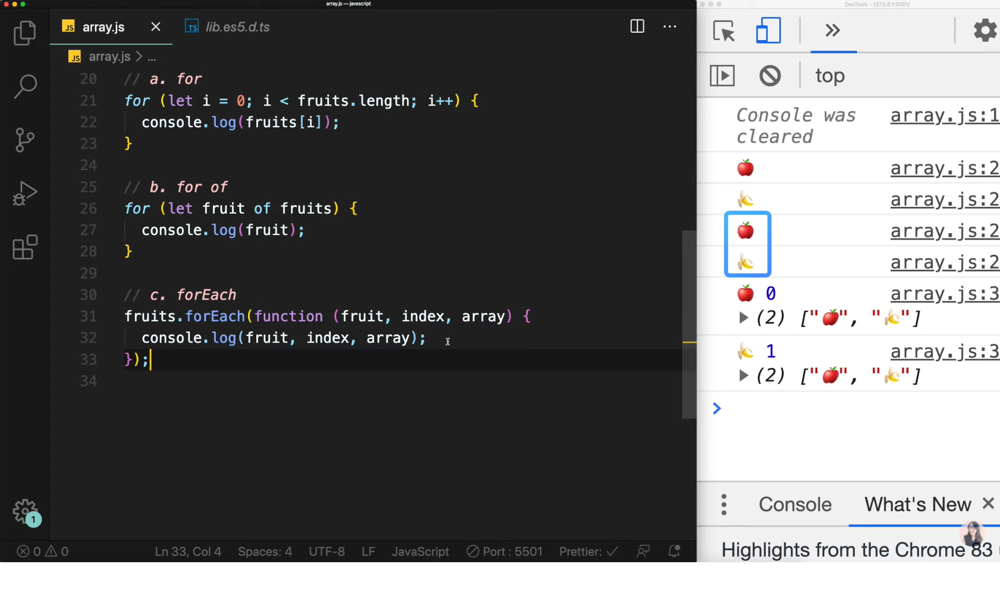
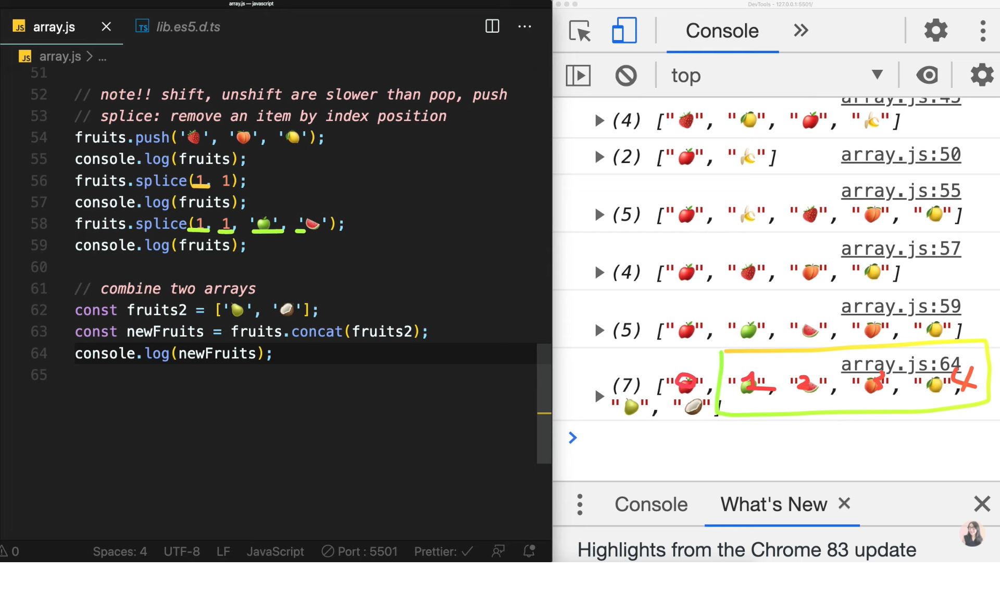
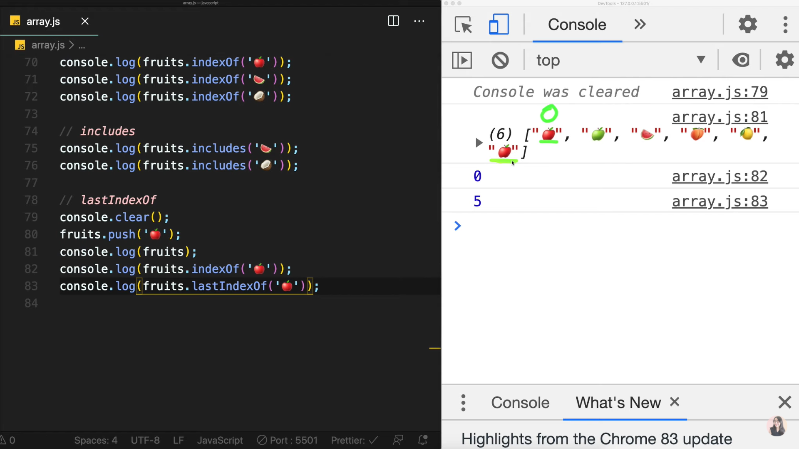

# Chapter 08

## 자바스크립트 8. 배열 제대로 알고 쓰자. 자바스크립트 배열 개념과 APIs 총정리 | 프론트엔드 개발자 입문편 (JavaScript ES6 )

---

<br><br>
토끼와 당근이 있습니다.<br>만약 토끼와 당근이 너무 많다면 분류하기 위해 바구니 같은 것을 사용할 것이다.<br><br>
<br><br>
위와 같이 프로그래밍 언어에서 비슷한 데이터 종류들끼리 묶어서 한 곳에 보관해 놓는 방법을 `자료구조`라고 합니다.<br><br>
그렇다면 저번 강의에서 객체 역시 비슷한 종류의 데이터들을 묶어놓는 역할을 한다고 했는데 객체와 자료구조의 차이점은 무엇일까?<br><br>
<br><br>
객체는 위의 사진에서 토끼 OR 당근이 될 수 있다.<br>토끼는 동물이며 귀가 2개라는 field와 먹는다와 뛴다라는 method를 가질 수 있습니다.<br>당근 역시 채소, 비타민c 라는 field를 가질 수 있지만 어떤 행동을 할 수 없기 때문에 method는 없을 수도 있다.<br><br>
이렇게 `Object`는 서로 연관된 특징과 행동을 묶어놓은 것을 말한다.<br>여기서 비슷한 타입의 Object들을 묶어서 놓은 것들을 바로 `자료구조`라고 합니다.<br><br>

그리고 보통은 동일한 타입의 객체들만 담을 수만 있다.(C,JAVA...)<br>하지만 자바스크립트는 Dynamic type language이기 때문에 아래와 같이 스파게티처럼 섞을 수가 있습니다.<br><br>
<br><br>
자바스크립트에서 가능은 하지만 이런식으로 사용하는 것은 좋지 않다.<br>또한 나중에 우리가 공부해야 할 부분은 자료구조와 알고리즘이다.<br>이렇게 물건들을 한 군데 모아놓은 자료구조들 중에서 새로운 데이터를 삽입할 때 얼마나 효율적으로 삽입할 수 있는가?<br>또한 삭제, 검색, 정렬할 때 어떤 알고리즘을 사용해서 정리를 할 수 있는지를 공부해야 합니다.<br>이것이 나중에 프로그래머스나 인터뷰 문제에서도 종종 등장합니다.<br><br>

---

### 배열이란?<br><br>

<br><br>
배열은 위와 같이 칸칸이 모여있는 자료구조를 말합니다.<br>한 배열안에는 동일한 데이터 타입을 모아두는 것이 중요하다.<br>자바스크립트는 앞에서 말했다시피 섞어서 담는 게 가능하기 때문에 이러한 실수를 하지 않도록 미리 방지하기를 바랍니다.<br>

1. Array Declaration

   ```
   const arr1 = new Array();
   const arr2 = [1, 2];

   새 객체를 만들듯이 new 키워드를 사용하는 방법도 있고
   또는 객체 안의 인덱스를 직접 지정해주는 방법도 있다.
   ```

2. Index Position

   ```
   const fruits = ['🍎', '🍌'];
   console.log(fruits);
   console.log(fruits.length)
   console.log(fruits[0]);
   console.log(fruits[1]);
   console.log(fruits[2]);
   console.log(fruits[fruits.length -1]); // 배열의 마지막 인덱스 접근

   result
   (2) ["🍎", "🍌"]
   2
   🍎
   🍌
   undefined
   🍌
   대괄호를 통해 배열에 접근할 수 있다.
   ```

3. Looping over an array

   <br><br>
   배열 데이터 전부를 출력하는 방법 3가지이다.<br>`1️⃣for문 사용하기`<br>`2️⃣for..of 사용하기`<br>`3️⃣forEach API사용하기`<br><br>
   forEach API에 대해 궁금하다면 반드시 API 문서를 읽는 방법을 추천하며 습관들이시길 바랍니다 :)<br>위와 같이 forEach api는 콜백함수로 3가지 인자를 가진다.<br>하지만 여기서 필요한 것은 fruit 한 가지 인자만 필요하니 식을 간결하게 줄여볼 수 있다.<br>

   ```
   fruits.forEach(fruit => console.log(fruit));
   ```

4. Addtion & Deletion & Copy

   <br><br>
   `push`: 배열의 뒤에서부터 삽입<br>
   `pop`: 배열의 뒤에서부터 삭제<br>
   `unshift` : 배열의 앞에서부터 삽입<br>
   `shift` : 배열의 앞에서부터 삭제<br><br>
   중요한 것은 shift & unshift는 pop & push보다 굉장히 느리다.<br>그 이유는 pop & push는 뒤에 있는 인덱스들만 삭제 & 삽입하면 되지만 shift & unshift는 앞에 있는 인덱스들을 삭제 & 삽입하기 위해서 인덱스를 하나하나씩 뒤로 밀어줘야 한다.<br>따라서 shift관련 명령어를 사용하기 보다 뒤에서 조작해주는 것이 더 좋은 방법이다.<br>

5. Splice: remove an item by index position

   <br><br>
   slice는 1번째 인자는 필수이지만 2번째 인자는 선택이다.<br>1번째 인자를 위의 사진처럼 넣어보지 말아보자.<br>결과는 보는바와 같이 1번 인덱스부터 끝까지 모든 인덱스들이 삭제가 된다.<br>만약 지정된 숫자만큼 삭제하고 싶다면 밑처럼 식을 바꿔줘야 한다.<br>

   ```
   fruits.splice(1, 1);
   console.log(fruits);

   result

   ["🍎", "🍓", "🍑", "🍋"]
   ```

   또한 지정된 숫자만큼 삭제하고 그 안에 추가하고 싶다면 밑처럼 식을 수정해야 합니다.<br>

   ```
   fruits.splice(1, 1, "🍏", "🍉");
   console.log(fruits);

   result

   ["🍎", "🍏", "🍉", "🍑", "🍋"]
   ```

6. Concat

   <br><br>
   2개의 배열을 합칠 수도 있는 배열 api이다.<br>

7. Searching

   <br><br>
   배열 안에서 찾고싶은 인덱스 번호가 있다면 `indexof`를 사용할 수 있다.<br>만약 배열 안에 찾고싶은 인덱스가 있는지 확인하고 싶다면 `includes`를 사용해 boolean값을 확인할 수 있다.<br><br>

   <br><br>
   만약 찾고싶은 인덱스가 중복되어 있다면 `lastIndexOf`를 사용해 가장 중복되는 것 중 마지막 인덱스를 반환합니다.<br><br>

이번 강의는 여기서 마무리 입니다:)<br><br>
이 글은 [유튜브 드림코딩 by 엘리 채널](https://www.youtube.com/watch?v=yOdAVDuHUKQ&list=PLv2d7VI9OotTVOL4QmPfvJWPJvkmv6h-2&index=8)을 통해 리뷰를 작성한 것이며 어떠한 상업적 목적으로도 사용되지 않았습니다. 추후 문제가 되는 점을 발견하시면 댓글을 통해 남겨주시는대로 수정하겠습니다 :)
