# Chapter 09

## 자바스크립트 9. 유용한 10가지 배열 함수들. Array APIs 총정리 | 프론트엔드 개발자 입문편 ( JavaScript ES6)

---

### Arrays APIs 총 정리!<br>

1. Join

   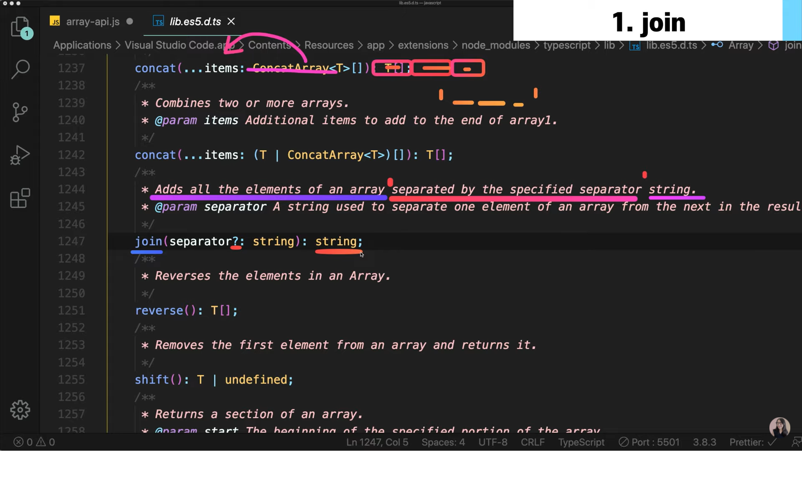<br><br>
   Join api 문서를 찾아보면 배열의 모든 엘리먼트들을 더하고 string으로 return 한다고 한다.<br>또한 우리가 설정해준 seperator를 통해 문자열을 각각 구분한다고 한다.<br>그런데 seperator는 ?가 들어가 있는데 포함해줘도 되고 안시켜줘도 상관없다는 의미이다. 어쨋든 결과는 string으로 return이 된다고 하니 한 번 실험해보자.<br><br>

   ```
   const fruits = ['apple', 'banana', 'orange'];
   const result = fruits.join();
   console.log(result);

   result

   apple,banana,orange
   ```

   ```
   만약 구분자를 전달한다면?
   const fruits = ['apple', 'banana', 'orange'];
   const result = fruits.join(|);
   console.log(result);

   result

   apple|banana|orange
   우리가 원하는 방식으로 얼마든지 구분자를 전달할 수 있다.
   ```

2. Split

   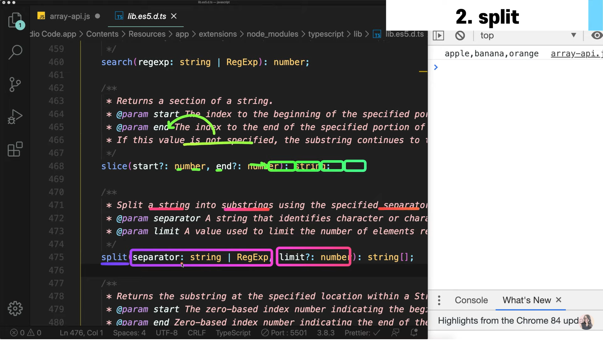<br><br>
   string을 여러가지 문자열로 나눠주는데 전달된 seperator를 통해 잘게 나눠준다.<br>그림과 같이 split api는 두 개의 인자를 받는데 1번째 인자는 필수고 2번째 인자는 선택이다. return값은 문자열 배열이다.<br><br>

   ```
   const fruits = '🍎, 🥝, 🍌, 🍒';
   const result = fruits.split();
   console.log(result);
   const result = fruits.split(",");
   console.log(result);

   result

   ['🍎, 🥝, 🍌, 🍒']
   // 구분자를 지정하지 않았기 때문에 문자열 자체가 하나의 인덱스로 배열에 들어간 모습이다.
   ["🍎", "🥝", "🍌", "🍒"]
   ```

3. Reverse

   ```
   const array = [1, 2, 3, 4, 5];
   const result = array.reverse();
   console.log(result);
   console.log(array);

   result

   [5, 4, 3, 2, 1]
   [5, 4, 3, 2, 1]
   // 원래 있던 array 배열도 reverse된 모습이다.
   ```

4. Slice

   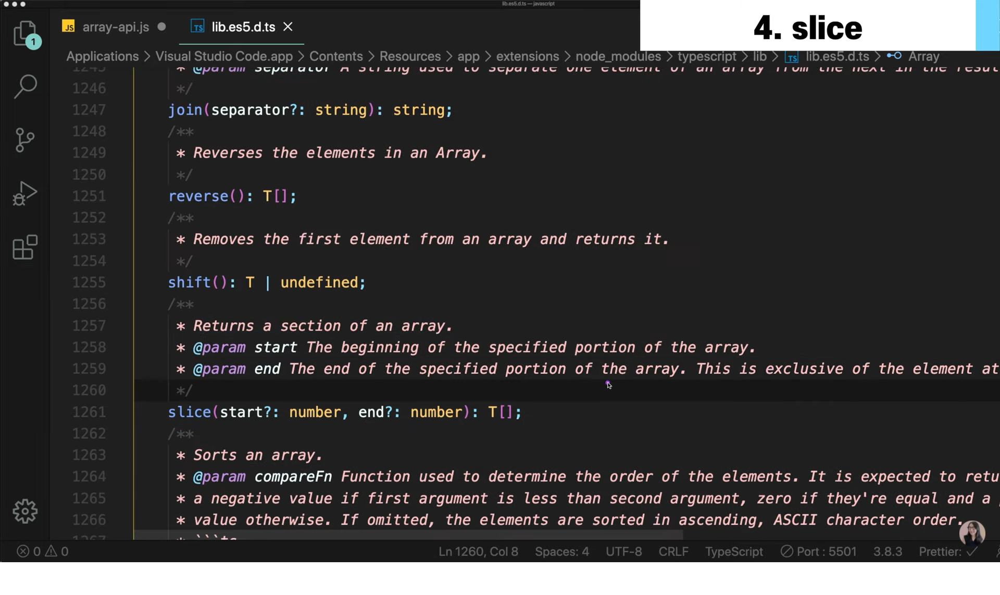<br><br>
   배열의 한 section을 리턴한다.<br>파라미터로는 start와 end가 존재하고 둘 다 선택인자이다.<br>알아두어야 할 것은 end인자는 마지막 element를 배제하기 때문에 예를들어 0부터 2까지 파라미터로 지정해주면 2가 아닌 1번째 인덱스까지만 return한다.<br>return은 배열로 반환한다.<br>

   ```
   const array = [1, 2, 3, 4, 5];
   const result = array.splice(1, 2);
   console.log(result);
   console.log(array);

   result

   [1, 2]
   // Splice는 return값이 존재하기 때문에 return값에서 삭제한 인덱스들을 볼 수 있음
   [3, 4, 5]
   // 삭제되고 남은 배열이다.
   // 즉, splice는 배열 자체를 수정할 때 사용합니다.
   ```

   ```
   const array = [1, 2, 3, 4, 5];
   const result = array.slice(2, 5);
   console.log(result);
   console.log(array);

   result

   [3, 4, 5]
   // Splice와 다르게 새로운 배열 result를 만듭니다.
   // 2 부터 5까지가 아닌 2번 인덱스부터 4번 인덱스까지 들어있는 배열을 반환합니다.
   [1, 2, 3, 4, 5]
   // 기존 배열은 그대로 남아있다.
   // 즉, slice는 배열에서 원하는 부분만 받아오고 싶을 때 사용하는 api입니다.
   ```

5. Find

   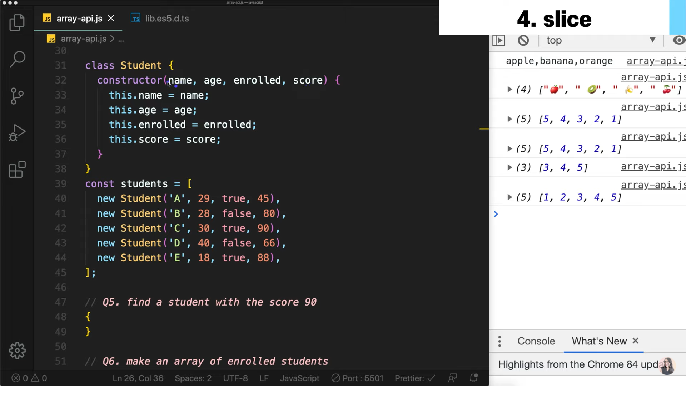<br><br>
   위에서 90점 이상의 학생을 찾는 api를 사용해 봅시다.<br><br>

   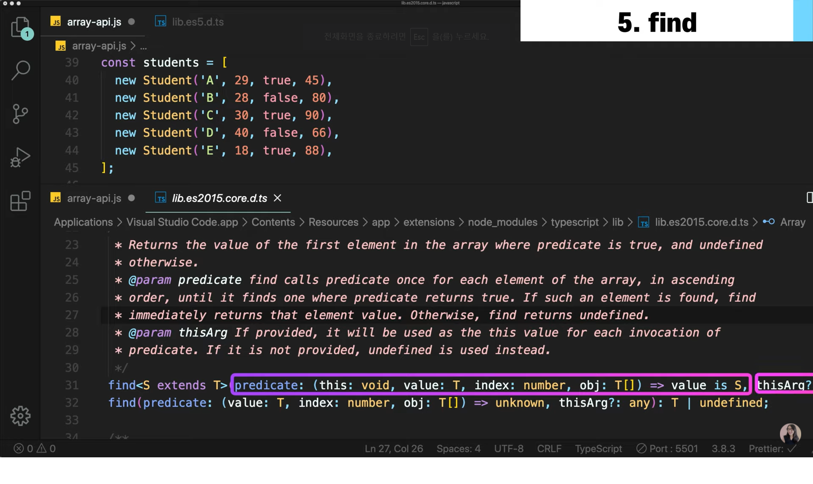<br><br>
   `Find` api는 1번째 인자로 콜백함수(predicate)를 가지며 콜백함수는 'this', 'value', 'index', 'obj'를 인자로 가집니다.<br>2번째 인자는 thisArg로 선택인자입니다.<br>Find api는 배열 안에서 첫 번째로 찾아진 요소를 반환합니다.<br><br>

   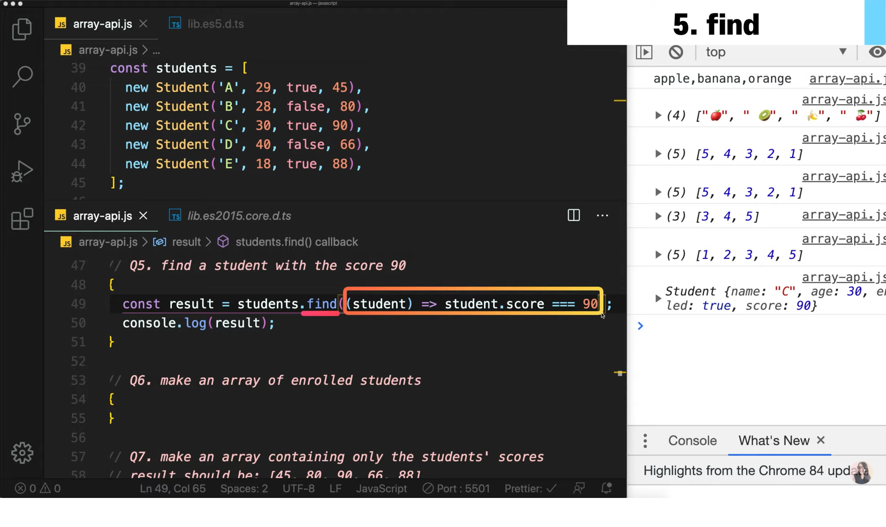<br><br>
   보시다시피 콜백함수는 배열의 모든 인자마다 실행이 되고 return값이 true(학생의 점수가 90점)를 반환하면 find api는 해당하는 배열의 요소를 return합니다.<br>

6. Filter

   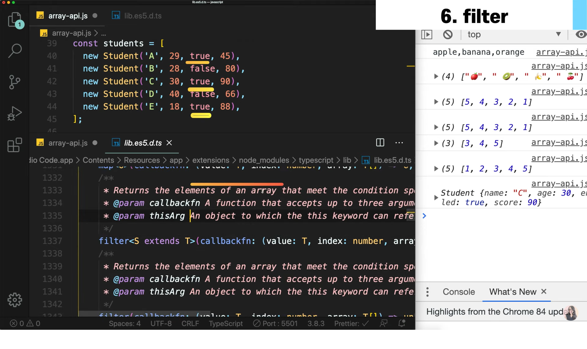<br><br>
   수업에 등록된 학생들을 반환하고 싶을 때.. 즉, enrolled가 true인지 false인지 확인하는 작업을 합니다.<br>`filter` api의 문서를 읽어보면 하나의 콜백함수를 가지며 조건에 맞는 배열의 요소를 반환하는 듯 합니다.<br>

   ```
   const result = students.filter((student) => student.enrolled);
   console.log(result);

   result

   [Student, Student, Student]
   // true를 가진 3명의 학생이 반환됩니다.
   ```

7. Map

   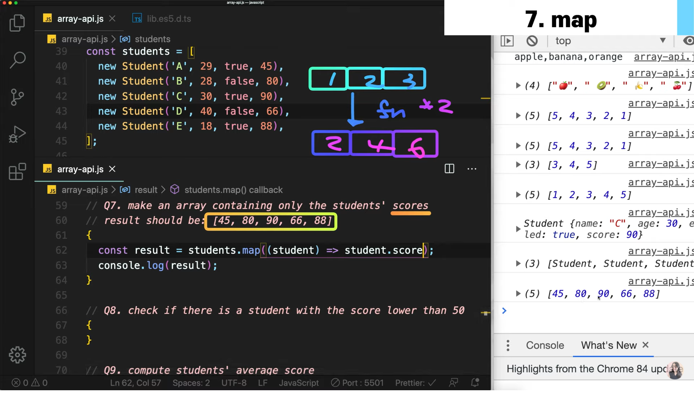<br><br>
   배열 안에 들어있는 한 가지 한 가지 요소들을 다른 것으로 변환해주는 것을 말합니다.<br>위 사진과 같이 배열 안의 학생 요소들에서 시험점수만 빼오고 싶다면 map api의 콜백함수를 어떻게 처리하느냐에 따라 이것이 쉽게 가능합니다.<br>즉, `Map`은 배열의 모든 요소에서 콜백함수를 통해 새롭게 가공하는 것을 합니다.<br>

8. Some

   <br><br>
   `Some`은 위와 같이 배열의 요소 중에서 콜백함수가 return값을 true를 반환하는 요소가 있는지 확인을 합니다.<br>

   ```
   const result = students.some((student) => student.score <= 90)
   console.log(result);
   const result2 = students.every((student) => student.score <= 90)
   console,log(result);

   result

   true
   // 배열에서 들어있는 요소들 중 하나라도 조건을 만족하면 true를 반환합니다.(some)
   false
   // 배열에서 들어있는 모든 요소들이 조건을 만족하면 true를 반환하고 하나라도 false이면 false를 반환합니다.

   // 즉, 배열 중에 어떤 것이라도 하나 만족되는 것이 있는지 없는지를 확인하고 싶다면 some
   // 모든 배열이 조건을 만족해야된다면 every를 사용합시다.
   ```

9. Reduce

   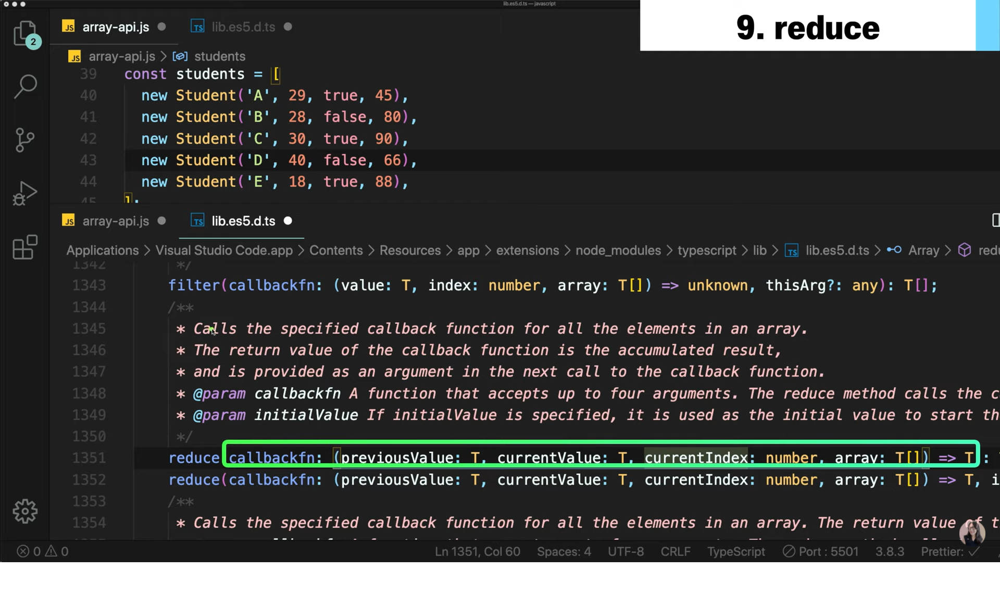<br><br>
   `Reduce` api는 위와 같이 콜백함수를 가지고 또는 initialValue도 가질 수 있다.<br>콜백함수는 다른 배열api와 마찬가지로 모든 배열 원소들마다 호출됩니다.<br>여기서 콜백함수는 어떤 값들이 누적된 결과를 반환합니다.<br>따라서 reduce는 배열에 있는 모든 값을 누적할 때 사용되는 경우이다.<br>

   ```
   const result = students.reduce((prev, curr) => prev + curr.score, 0)
   console.log(result / students.length)

    result

    73.8

   // initalValue를 0으로 지정해줬기 때문에 prev가 0부터 시작합니다.
   // reduce는 콜백함수가 return을 가져야 하는데 이 return값이 배열의 다음 원소에서 콜백함수가 호출될 때 prev값으로 들어가게 됩니다.(이해가 안간다면 그냥 무시하고 이것만 기억하자 => '배열에서 자기가 원하는 것을 싸그리 누적하는 방법이다')
   // reduceRight api는 배열의 뒤부터 시작하게 됩니다.
   ```

10. Quiz

    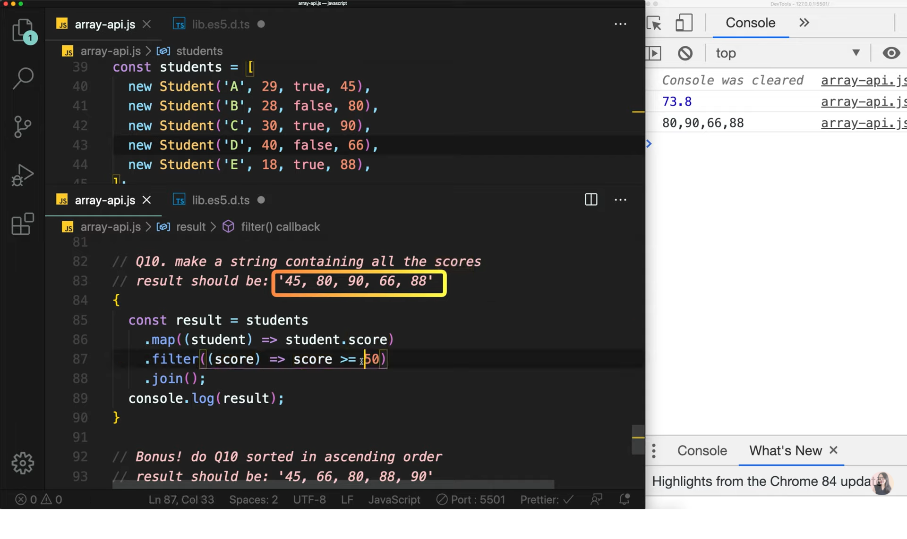<br><br>
    모든 학생들의 점수를 string으로 변환하는 퀴즈입니다.<br><br>

    지금까지 배웠던 것들을 활용해서 배열 APIs들을 사용하여 알고리즘을 효율적으로 짤 수 있습니다.<br>
    `1️⃣Map API를 사용해 먼저 학생들 점수 배열을 새로 만들어주자`<br>
    `2️⃣Filter API를 통해 50점 이상인 점수들만 배열로 만들 수 있습니다.`<br>
    `3️⃣Join API를 사용해 배열을 문자열로 만들 수 있습니다.`<br>

11. Sort

    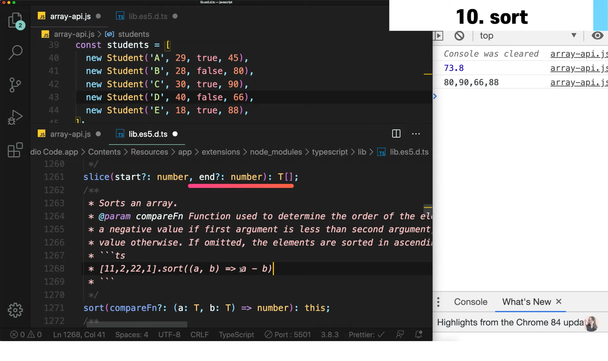<br><br>
    모든 학생들의 점수를 순차적으로 변환하는 퀴즈입니다.<br><br>

    ```
    const result = students
    .map((student) => student.score)
    .sort((a, b) => a - b)
    .join();
    ```

    `1️⃣Map API를 사용해 먼저 학생들 점수 배열을 새로 만들어주자`<br>
    `2️⃣Sort API를 통해 오름차순 또는 내림차순으로 정렬할 수 있습니다.`<br>
    `3️⃣Join API를 사용해 배열을 문자열로 만들 수 있습니다.`<br>

    Sort API는 콜백함수에서 양수가 반환되면 오름차순으로 정렬하며<br>음수가 반환되면 내림차순으로 반환합니다.<br>

이번 강의는 여기서 마무리 입니다:)<br>
배열 API에 대해서 알아봤는데 굳이 외울 필요는 없다고 생각합니다.<br>이러이러한 것들이 존재했구나 머리에 넣어두고 무엇인가 만들어 볼 때 그때그때 API 문서를 뒤지면서 사용해보면 암기는 자동으로 따라올 것 입니다.<br><br>
이 글은 [유튜브 드림코딩 by 엘리 채널](https://youtu.be/3CUjtKJ7PJg?list=PLv2d7VI9OotTVOL4QmPfvJWPJvkmv6h-2)을 통해 리뷰를 작성한 것이며 어떠한 상업적 목적으로도 사용되지 않았습니다. 추후 문제가 되는 점을 발견하시면 댓글을 통해 남겨주시는대로 수정하겠습니다 :)
