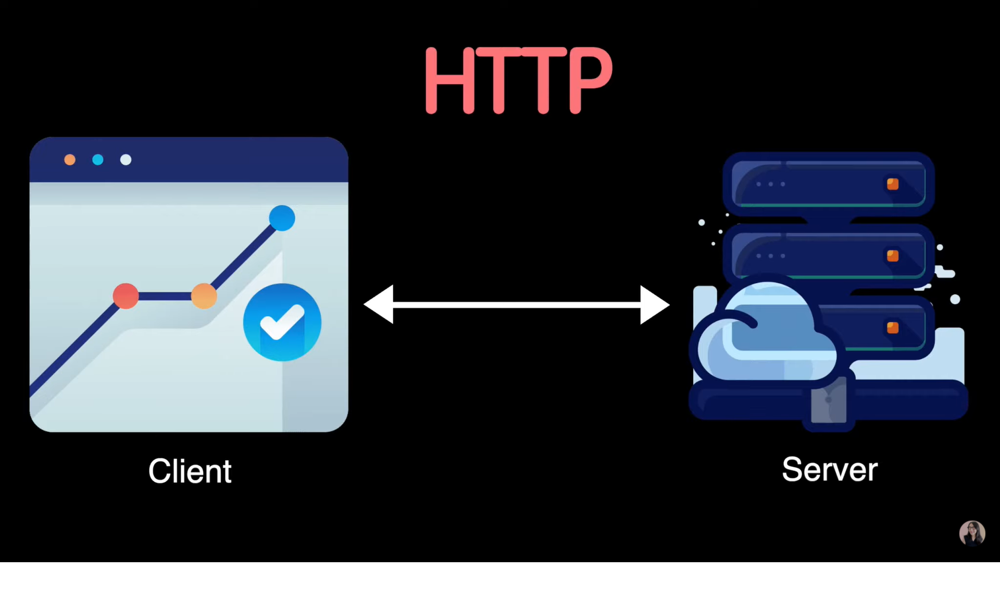
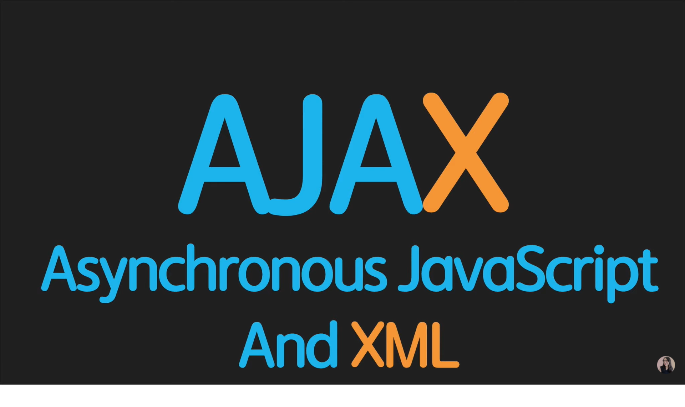
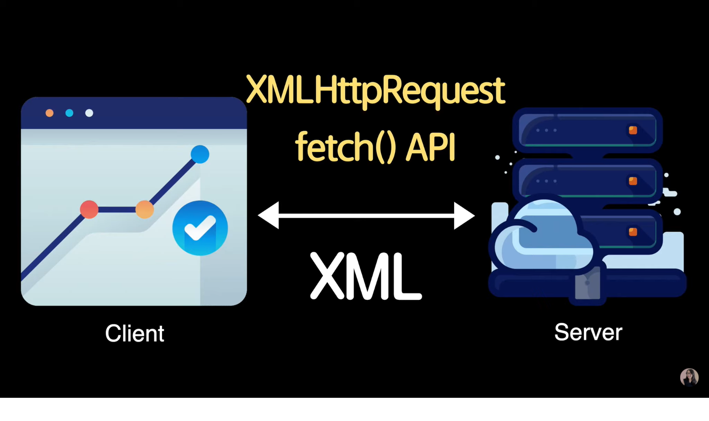
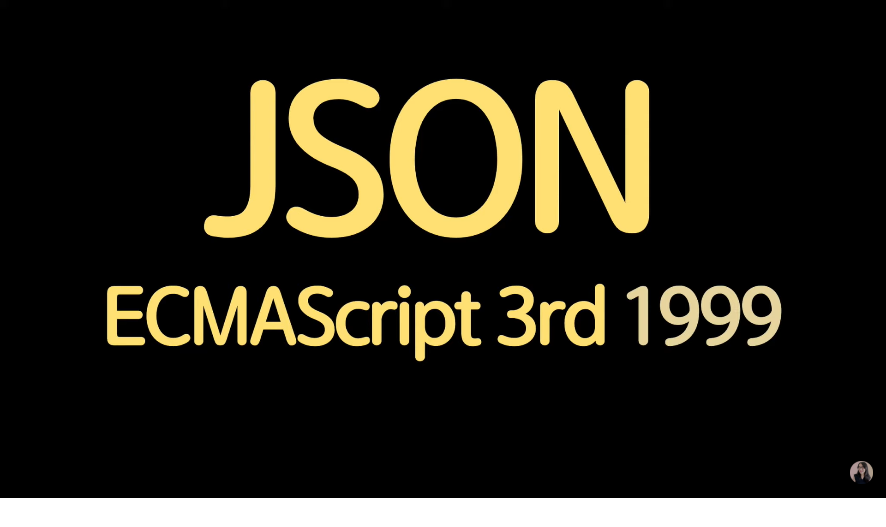
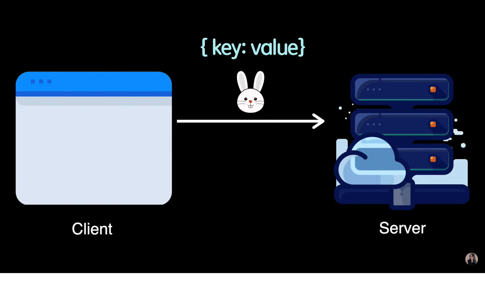
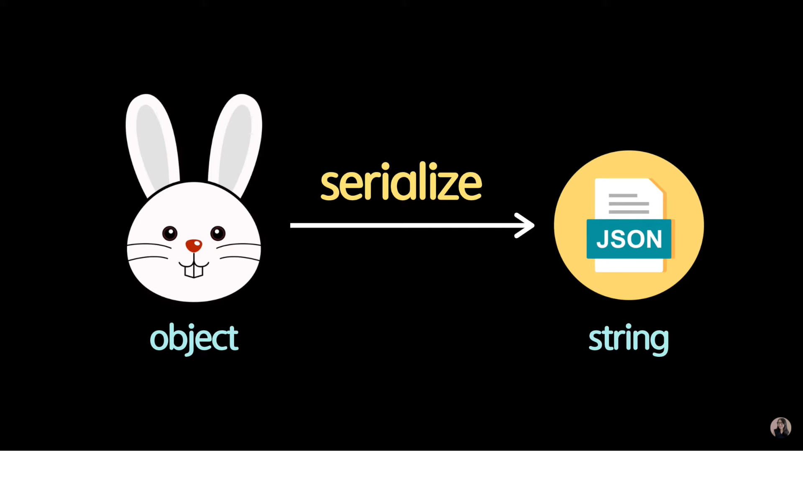
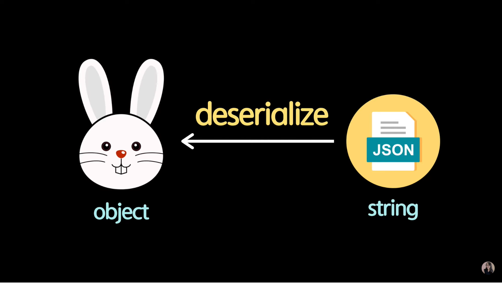
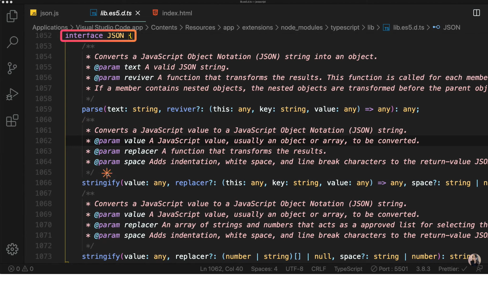

# Chapter 10

## 자바스크립트 10. JSON 개념 정리 와 활용방법 및 유용한 사이트 공유 JavaScript JSON | 프론트엔드 개발자 입문편 (JavaScript ES6)

---

### 서버 통신의 시작 JSON

<br><br>
브라우저 위에서 동작하는 웹사이트 또는 웹 어플리케이션<br>
즉, 클라이언트들이 어떻게 서버와 통신할 수 있는지를 정의한 것이 바로 `HTTP`이다.<br>
HTTP는 클라이언트가 서버에게 데이터를 `request`(요구)하고<br>
서버는 클라이언트의 요구에 맞게 그에 따른 `response`(응답)하는 것을 의미합니다.<br><br>

<br><br>
HTTP를 통해 서버에게 데이터를 받아올 수 있는 방법은 바로 `AJAX`이다.<br>
Asynchronous JavaScript And XML의 약자로 웹페이지에서 동적으로 데이터를 받아올 수 있는 기술을 의미합니다.<br>
대표적으로는 XMLHttpRequest라는 Object가 있다.<br>
이것은 브라우저 API에서 제공하는 Object중 하나로 이 Object는 서버에게 간단하게 데이터를 요청하고 받아오는 것이 가능합니다.<br>
또한 최근에 추가된 fetch() 브라우저API를 이용하면 간편하게 데이터를 주고 받을수도 있습니다.<br>
fetch()는 최근에 추가되어서 IE에서 지원이 되지않는다..<br><br>

<br><br>
다시 말하자면 브라우저가 서버와 통신하는 방법에는 fetch()가 있을 수도 있고<br>
또한 요즘도 많이 사용되는 XMLHttpRequest를 사용할 수도 있습니다.<br>
XML은 불필요한 태그가 너무 많이 사용되어서 파일 사이즈도 커질 뿐만 아니라 가독성도 좋지 않기 때문에 XML은 많이 사용되지 않는다.<br>
그럼 요즘에는 무엇을 사용하느냐?<br>

<br><br>
최근에는 XML 대신 `JSON`을 사용하고 있습니다.<br>
JavaSciprt Object Notation의 약자로 1999년도 ECMAScript 3번째 버전에서<br>
사용되는 Object에서 큰 영감을 받고 만들어진 `데이터 포맷`입니다.<br>
JSON은 Object와 상당히 비슷하게 생겼으며<br>
브라우저 뿐만 아니라 모바일에서도 데이터 통신을 위해 사용되어 지며<br>
또는 데이터를 주고 받지 않아도 Object를 파일 시스템에 저장할 때도<br>
JSON 타입을 많이 사용하고 있습니다.<br>

```
즉 JSON
1. 데이터를 주고 받을 수 있는 가장 간단한 데이터 포맷이다.
2. 텍스트로 기반으로 이루어져 가벼우며
3. 일기(가독성) 또한 좋다.
4. 키와 쌍으로 구성되었으며
5. 데이터를 주고 받을 때 그리고 Serialize를 위해 사용됩니다.
6. 가장 중요한 점은 프로그래밍 언어나 플랫폼에 상관없이 쓸 수 있다는 것입니다.
```

<br><br>
정리를 하자면 브라우저에서 토끼 오브젝트를 서버로 보낼 때 {key : value}<br>
String 형식으로 보내게 되며 서버에서 브라우저로 보낼 때도 {key : value}<br>
String 형태로 보내게 됩니다.<br>
그 후에 브라우저에서 String타입을 받아서 토끼 오브젝트로 다시 변환해서 보여주는 것이죠.<br><br>

<br><br>
<br><br>
즉, 우리가 JSON에 대해서 알아야 할 것은 Object를 어떻게 `Serialize`해서<br>
JSON 파일로 변환할 것인지 그리고 다른 하나는 Serialize 된 JSON을 다시<br>
어떻게 `Deserialize`해서 Object 파일로 변환할 것인지에 대해 알아야 합니다.<br><br>

1. Object to JSON

   <br><br>
   JSON API 문서를 읽어보면 총 2가지 함수가 존재하는데 하나는 parse 나머지 하나는 stringify입니다.<br>
   동일한 stringify가 2개가 있는 것을 확인할 수 있는데 함수이름은 같지만 매개변수가 달라 다른 역할을 하는 이것을 `오버로딩`이라고 합니다.<br>

   JSON이라는 Object를 통해 간단하게 변환할 수 있습니다.<br>
   JSON.stringify는 첫 번째 매개변수로 Object를 받고 두 번째 매개변수는
   replacer라는 콜백함수(선택)을 받습니다.이 콜백함수는 결과를 변형시키는데
   더 세밀하게 조정이 가능합니다.<br>마지막으로 stringify는 json을 반
   환합니다.<br>

   ```
   let json = JSON.stringify(true); // Object를 JSON으로 변경할 수 있음
   console.log(json);

   json = JSON.stringify(['apple', 'banana']);
   console.log(json);

   const rabbit = {
       name: 'tory',
       color: 'white',
       size: null,
       symbol: Symbol(id),
       birthDate: new Date(),
       jump: () => {
           console.log(`${this.name} can jump!`);
       }
   }

   json = JSON.stringify(rabbit);
   console.log(json);
   json = JSON.stringify(rabbit, ['name', 'color']);
   console.log(json);
   json = JSON.stringify(rabbit, (key, value) => key === 'name' ? 'ellie' : value);
   console.log(json);

   result

   true
   ["apple", "banana"]
   {"name":"tory", "color":"white", "size":null, "birthDate":"2020-05-
   29T13:20:22.670Z"}
   {"name":"tory", "color":"white"}
   {"name":"ellie", "color":"white", "size":null, "birthDate":"2020-05-
   29T13:20:22.670Z"}
   // jump 메서드는 json에 포함되지 않았다.
   // 또한 자바스크립트에만 존재하는 Symbol API 등은 변환되지 않음.
   ```

2. JSON to Object

   JSON.parse는 어떠한 String을 받아서 Object로 변환할 수 있습니다.<br>
   첫 번째 매개변수는 Object를 받고 두 번째 매개변수는 reviver라는
   콜백함수(선택)을 받습니다.<br>이 콜백함수는 결과를 변형시키는데
   더 세밀하게 조정이 가능합니다.<br>마지막으로 parse는 Object를 반
   환합니다.<br>

   ```
   1번과 이어집니다.
   json = JSON.stringify(rabbit);
   let obj = JSON.parse(json);
   console.log(obj);
   rabbit.jump();
   obj.jump();

    console.log(obj.birthDate.getDate());
   obj = JSON.parse(json, (key, value) => key === 'birthDate' ?
   new Date(value) : value);
   console.log(rabbit.birthDate.getDate());
   console.log(obj.birthDate.getDate());

   result
    {"name":"tory", "color":"white", "size":null, "birthDate":"2020-05-
   29T13:20:22.670Z"}
   can jump!
   Error
   Error
    29
    29
   // Object가 JSON으로 Serialize할 때 메서드는 데이터가 아님으로
   포함되지 않기 때문에 마찬가지로 Deserialize해도 jump()메서드가
   존재하지 않음
    // rabbit의 birthDate.getDate는 Date객체의 API를 사용했지만
    obj의 birthDate.getDate는 Deserialize할 때 그저 String으로
    변환되었기 때문에. getDate를 사용해도 에러가 발생함!
    하지만 Deserialize를 할 때 콜백함수에서 세부조정을 함으로써
    obj도 getDate()메서드를 사용할 수가 있게 됩니다.
   ```

3. 유용한 사이트 몇 가지

   - [JSON diff](http://www.jsondiff.com/)
     (서버에서 요청해서 받아온 첫 번째 데이터와 두 번째 데이터의 차이점을
     모르겠을 때 사용)

   - [JSON Beautifier/editor](https://jsonbeautifier.org/)
     (서버에서 받아온 JSON포맷이 망가져있을 때 예쁘게 만들어줌)

   - [JSON Parser](https://jsonparser.org/)(JSON과 Object가 서로 변환
     되면 어떻게 생기는지 궁금할 때 사용)

   - [JSON Validator](https://tools.learningcontainer.com/json-validator/)
     (유효한 JSON인지 검사해주는 사이트)

이번 강의는 여기서 마무리 입니다:)<br><br>
이 글은 [유튜브 드림코딩 by 엘리 채널](https://www.youtube.com/watch?v=FN_D4Ihs3LE&list=PLv2d7VI9OotTVOL4QmPfvJWPJvkmv6h-2&index=10)을 통해 리뷰를 작성한 것이며 어떠한 상업적 목적으로도 사용되지 않았습니다. 추후 문제가 되는 점이 있으면 댓글을 통해 남겨주시면 수정하겠습니다 :)
