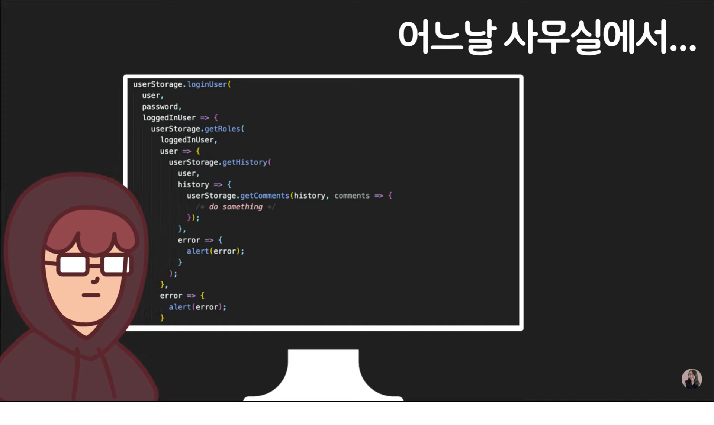
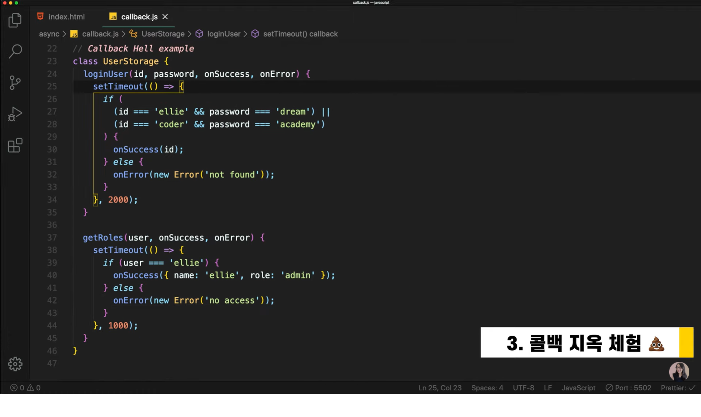
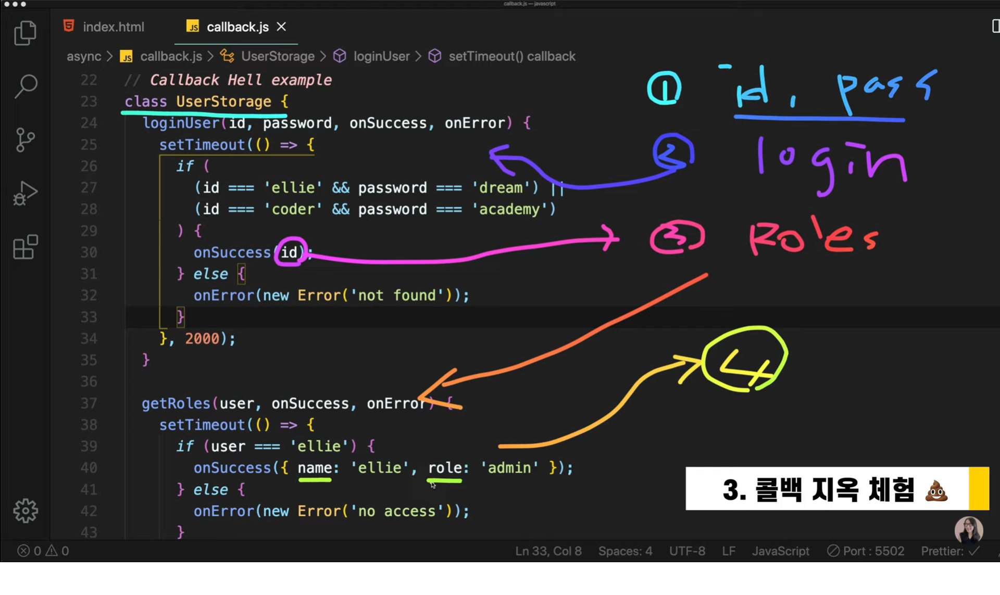
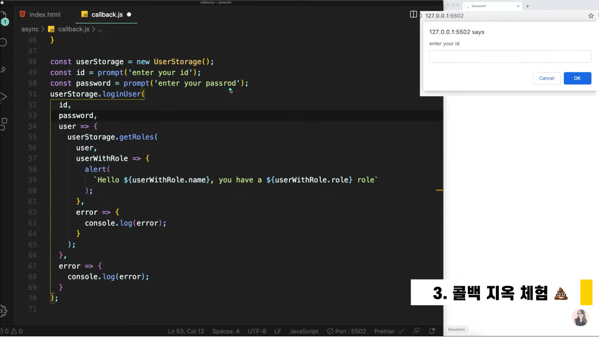

# Chapter 11

## 자바스크립트 11. 비동기 처리의 시작 콜백 이해하기, 콜백 지옥 체험 😱 JavaScript Callback | 프론트엔드 개발자 입문편 (JavaScript ES6)

---

<br><br>
ㅁㅋㅋㅋㅋㅋㅋㅋㅋㅋㅋㅋㅋㅋㅋㅋㅋㅋㅋㅋㅋㅋㅋㅋㅋㅋㅋㅋㅋㅋㅋㅋㅋ<br>
짤보자마자 터졌네요 ㅋㅋㅋ<br>
선임분이 많은 생각이 드셨을 듯 합니다.<br><br>

---

자바스크립트는 동기적으로 작동합니다.<br>
이 말은 호이스팅이 된 이후부터 우리가 작성한 코드 순서대로 하나하나씩
동기적으로 실행된다는 말입니다.<br>
그렇다면 비동기는 무슨 말일까요?<br>
바로 동기와 다르게 언제 실행될 지 예측할 수 없는 코드들을 말합니다.<br>

```
console.log("1");
setTimeout(() => console.log("2"), 1000);
console.log("3");

result

1
3
2
```

자바스크립트 엔진은 위에서 아래로부터 순차적(동기)으로 실행하게 됩니다.<br>
setTimeout은 대표적인 비동기 함수로 콜백함수를 호출합니다.<br>
단, 브라우저는 setTimeout이 끝날때까지 기다리지 않음<br>
때문에 결과는 1 -> 3 -> 2 로 실행되게 되며 이것이 비동기적 실행입니다.<br>
즉. setTimeout의 콜백함수는 1초가 지나고 나중에 부르기 때문에 `CallBack`이라고 불립니다.<br><br>

콜백은 2가지 경우로 나뉩니다.<br><br>

1. Synchronous CallBack

   ```
   console.log("1");
   setTimeout(() => console.log("2"), 1000);
   console.log("3");

   function printImmediately(print) {
       print();
   }
   printImmediately(() => console.log("hello"));

   result

   1
   3
   hello
   2
   // printImmediately는 콜백함수를 받아서 바로 실행하게 함
   // hello는 바로 실행되지만 2는 1초 후에 실행됨
   ```

2. Asynchronous CallBack

   ```
   console.log("1");
   setTimeout(() => console.log("2"), 1000);
   console.log("3");

   function printImmediately(print) {
       print();
   }
   printImmediately(() => console.log("hello"));

   function printWithDelay(print, timeout) {
      setTimeout(print, timeout)
   }
   printWithDelay(() => console.log("async callback"), 2000);

   result

   1
   3
   hello
   2
   async callback
   // printWithDelay함수는 콜백함수를 2초후에 실행하게 됩니다.
   ```

   즉, 우리가 만든 코드는 자바스크립트(브라우저)가 사실상 아래와 같이 실행합니다.<br>

   ```
   function printImmediately(print) {
      print();
   }

   function printWithDelay(print, timeout) {
     setTimeout(print, timeout)
   }

   console.log("1"); // 동기
   setTimeout(() => console.log("2"), 1000); // 비동기
   console.log("3"); // 동기
   printImmediately(() => console.log("hello")); // 동기
   printWithDelay(() => console.log("async callback"), 2000); // 비동기

   // 함수는 호이스팅으로 인해 파일 맨 위에 선언이 되고
   동기는 차례대로 실행이 되고 비동기는 빠졌다가 지정된 시간에 실행되는
   것입니다.
   ```

### Callback Hell Example<br><br>

데이터를 서버로부터 받아오는 클래스를 작성해 보겠습니다.<br>

<br><br>
UserStorage에는 총 2가지의 api가 존재합니다.<br>
`1️⃣loginUser API(로그인하는 API)`<br>
`2️⃣getRoles API(유저인지 관리자인지 확인하는 API)`<br><br>

여기서 우리가 해 볼 것은 총 4가지 단계로 나뉩니다.<br><br>

<br><br>

`1️⃣프론트에서 ID & Password를 입력해서`<br>
`2️⃣서버에서 로그인을 하고`<br>
`3️⃣로그인을 성공하면 받아오는 ID를 통해 getRoles API를 요청`<br>
`4️⃣마지막으로 API요청에 성공하면 이름과 역할을 출력하는 과정을 해보겠습니다.`<br><br>

<br><br>
클래스를 통해 객체를 생성하고 객체의 loginUser메서드를 호출합니다.<br>
매개변수로는 id, password, onSuccess, onError 총 4가지를 가집니다.<br>
로그인에 성공하면 getRoles메서드를 호출하고 3개의 매개변수를 가집니다.<br>
getRoles메서드의 onSuccess컬백함수가 실행되면<br>
`Hello ellie, you have a admin role`을 출력하고 마칩니다.<br><br>

보는 바와 같이 콜백함수 안에서 또 콜백함수를 부르고 이게 꼬리를 물듯이<br>
계속해서 이어진다면 이것을 `콜백 지옥`이라고 부릅니다.<br>
콜백 지옥음 다음과 같이 여러가지 문제점을 발생시킵니다.<br>
`1️⃣읽기가 너무 어렵다(가독성이 떨어짐)`<br>
`2️⃣에러가 발생하거나 디버깅을 해야할 때 굉장히 어려움을 가짐 + 유지보수도 어려움`<br><br>

다음 강의에서는 이러한 콜백 지옥에서 벗어나기 위해 사용되는 `Promise`와 `async + await`
방식에 대해서 알아보겠습니다.<br>
이번 강의는 여기서 마무리입니다 :)<br><br>
이 글은 [유튜브 드림코딩 by 엘리 채널](https://www.youtube.com/watch?v=s1vpVCrT8f4&list=PLv2d7VI9OotTVOL4QmPfvJWPJvkmv6h-2&index=11)을 통해 리뷰를 작성한 것이며 어떠한 상업적 목적으로도 사용되지 않았습니다. 추후 문제가 되는 점을 발견하시면 댓글을 통해 남겨주시는대로 수정하겠습니다 :)
