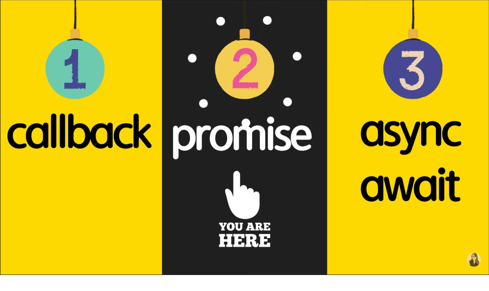
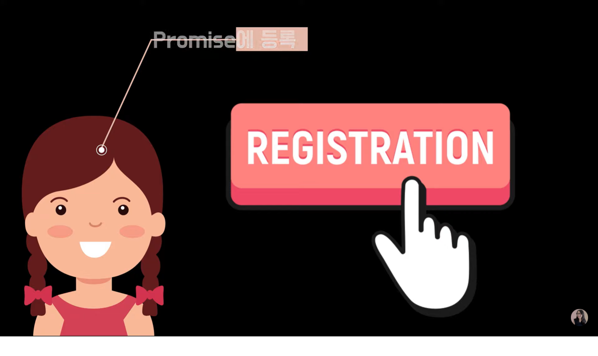
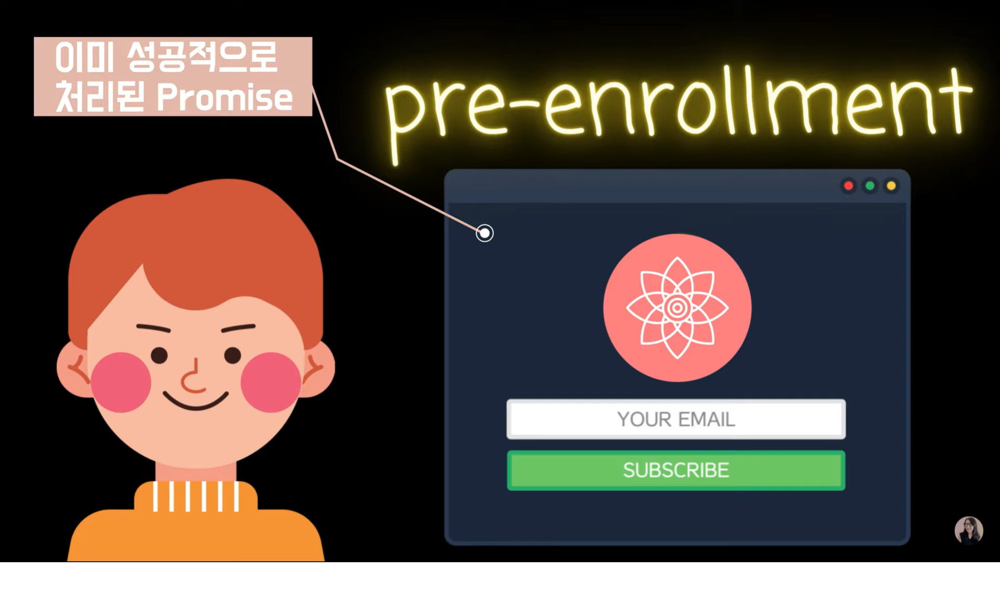
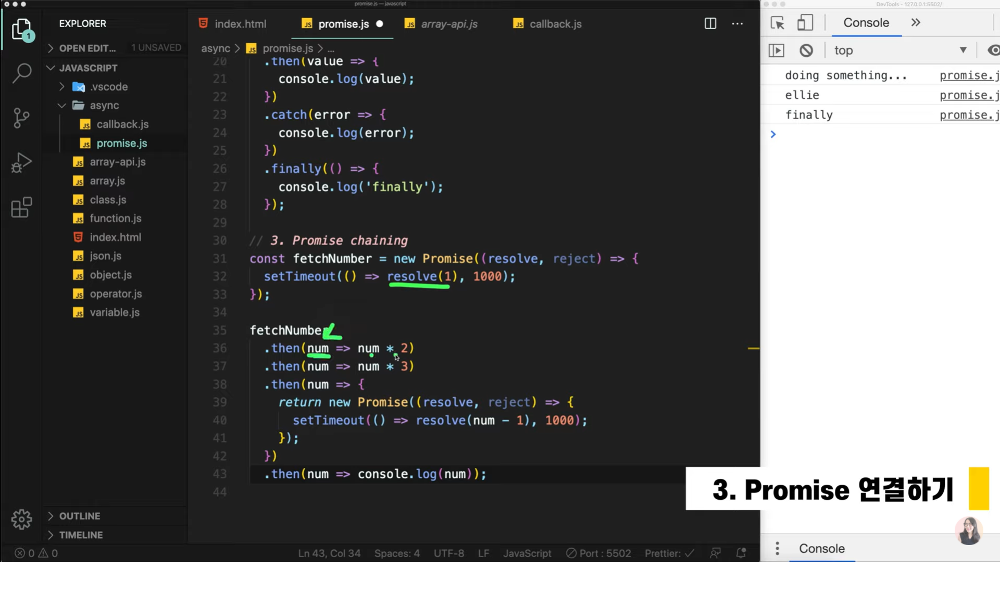
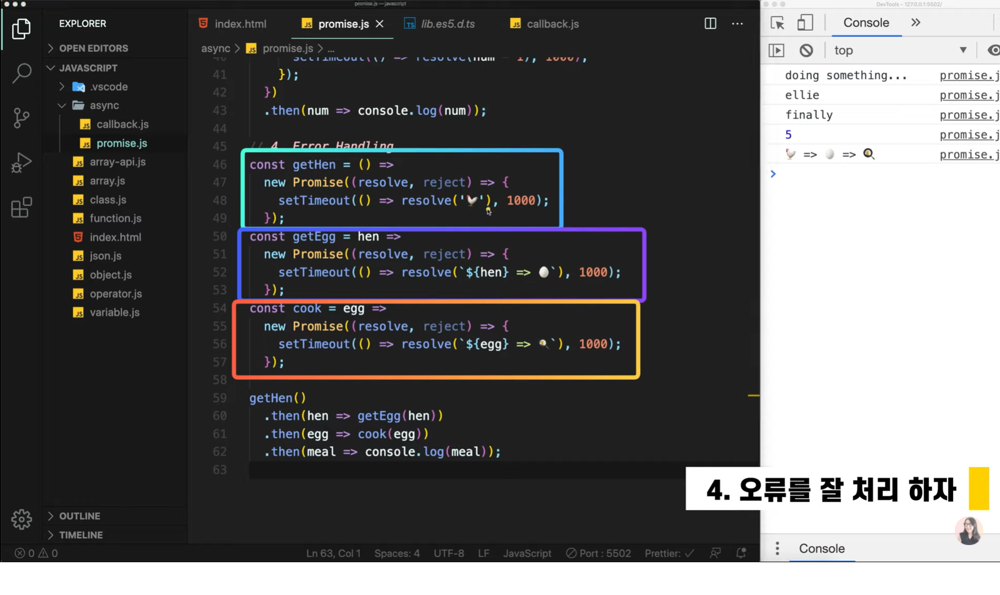
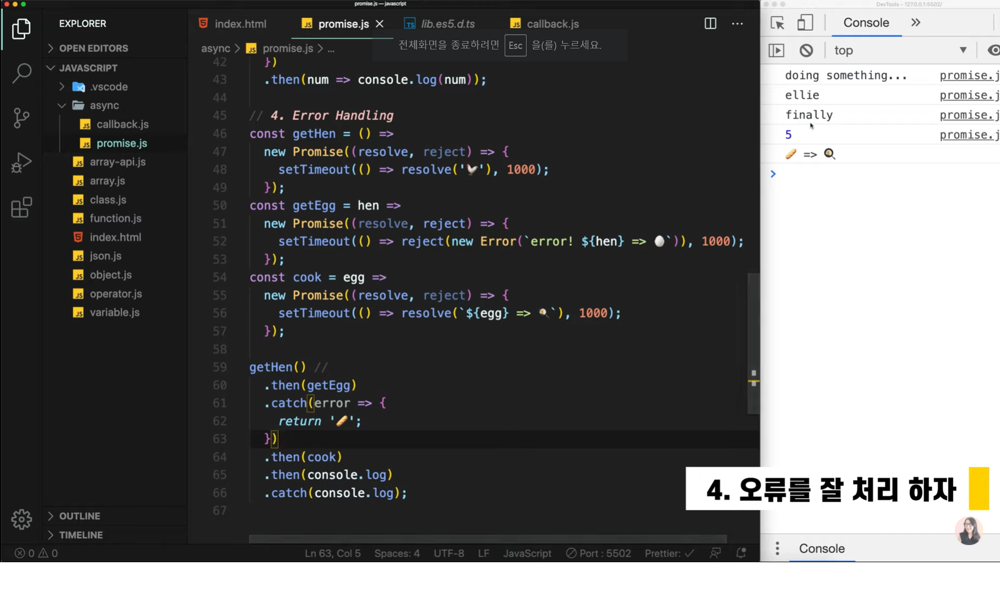
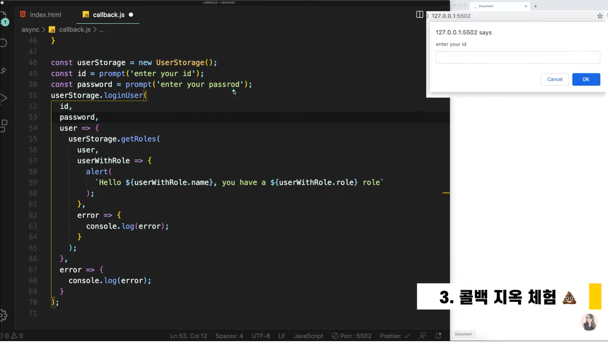
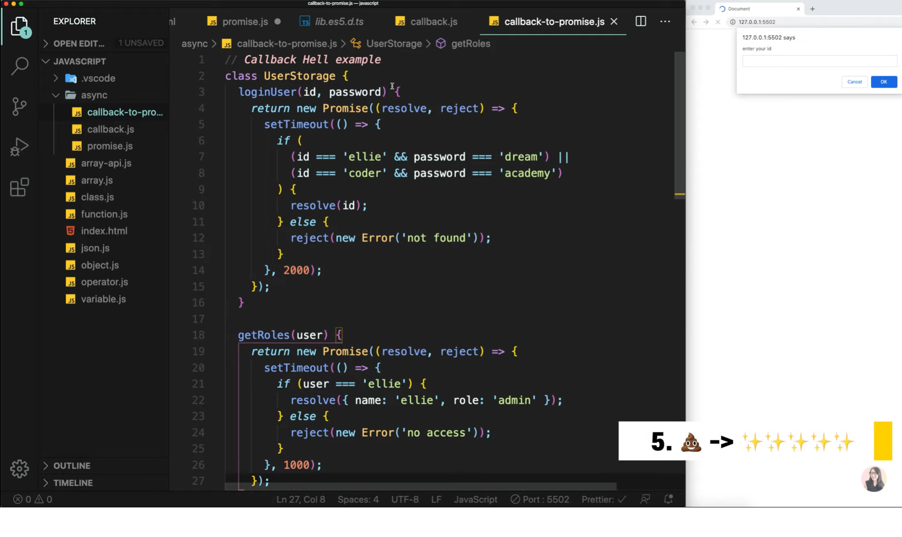

# Chapter 12

## 자바스크립트 12. 프로미스 개념부터 활용까지 JavaScript Promise | 프론트엔드 개발자 입문편 (JavaScript ES6)

---

<br><br>
대표적인 비동기는<br>
`1️⃣Callback`<br>
`2️⃣Promise`<br>
`3️⃣Async + Await`<br>
가 있습니다.<br><br>
지난 강의에서는 그 첫번째 '콜백'에 대해서 알아보았습니다.<br>
이번 강의에서는 두 번째 방법 `Promise`에 대해서 알아보겠습니다.<br><br>

프로미스는 자바스크립트에서 비동기를 간편하게 처리해주는 오브젝트입니다.<br>
프로미스는 정해진 임무를 수행하고 나서 정상적으로 기능이 수행되었다면
성공의 메시지와 함께 처리된 결과값을 전달해줍니다.<br>
만약 임무를 수행하다 정상적으로 수행되지 못하면 에러를 발생시킵니다.<br>

예를들어 엘리선생님이 학생들을 위해 강의를 만들고 있습니다.<br><br>
<br><br>
영희 학생은 수업이 열리지 않았지만 Promise로 미리 수업을 등록할 수 있다
는 것을 보고 미리 등록했습니다.<br><br>

<br><br>
때문에 나중에 수업이 열리게 된다면 영희학생은 수업이 열리는 동시에
수업이 오픈되었다는 이메일을 받을 수 있게 되는 것입니다.<br>
이것이 가능한 것은 Promise 객체를 사용했기 때문입니다.<br>

<br><br>
수업이 이미 열리고 뒤늦게 철수가 수업 등록을 하게됩니다.<br>
하지만 수업은 이미 오픈되었기 때문에 기다릴 필요가 없이 바로 철수에게
이메일이 오게 되고 수업에 바로 참여할 수 있게 되는 것입니다.<br><br>

---

Promise Object는 자바스크립트 내장 객체입니다.<br>
이것은 콜백함수 대신 비동기로 사용할 때 유용하게 사용할 수 있습니다.<br>
프로미스는 2가지의 개념을 중심으로 잘 이해하시면 됩니다.<br>
`1️⃣State`(주어진 일을 수행하는 중인지 이미 끝난상태인지 확인하는 것)<br>
`2️⃣Producer와 consumer에 대해 차이점을 아는 것이 중요합니다.`
우리가 원하는 데이터를 프로듀싱해주는 제공자와 이 데이터를 쓰는 사람=소비자의
차이를 이해하는 것입니다.<br>

우리가 Promise를 수행중일 때 -> `pending`상태<br>
pending 상태가 정상적으로 끝나면 -> `fulfilled`상태가 됩니다.<br>
또는 파일을 찾을 수 없거나 네트워크에 문제가 생기면 -> `rejected`상태가 됩니다.<br>

1. Producer

   ```
   when new Promise is created, the executor runs automatically

   const promise = new Promise((resolve, reject) => {
       //doing something heavy work(network, read files)
       console.log('doing something...');
       setTimeout(() => {
           resolve('ellie');
       }, 2000);
   })

   // 프로미스는 만드는 순간 executor라는 콜백함수가 자동적으로 실행되기
   때문에 이 점을 유의해야 합니다.
   // 프로미스가 생성되고 2초후에 resolve콜백함수가 실행되는 프로미스를
   생성했습니다.
   ```

2. Consumer

   ```
   프로미스를 사용하는 사용자들은 then & catch & finally를 사용해
   값을 받아올 수 있습니다.

   const promise = new Promise((resolve, reject) => {
       //doing something heavy work(network, read files)
       console.log('doing something...');
       setTimeout(() => {
           // resolve('ellie');
           // reject(new Error('no network'));
       }, 2000);
   })

   promise
       .then((value) => {
           console.log.(value);
       })
       .catch((error) => {
           console.log(error);
       })
       .finally(() => console.log('finally'));

   // then메서드는 promise가 정상적으로 잘 수행되어 실행된 resolve
   콜백함수에서 반환한 값을 value(ellie)로 받아오게 됩니다.
   만약에 promise에서 resolve를 반환하지 않고 reject를 반환하면
   어떻게 될까?(주석문)
   UnCaught Error가 발생합니다.
   때문에 reject를 받고 싶으면 then 메서드가 아닌 catch메서드를 사용합니다.
   마지막으로 finally 메서드는 성공실패 여부 상관없이 무조건 실행됩니다.
   ```

3. Promise 연결하기

   <br><br>
   Promise는 어떤 값을 리턴하기도 하지만 보는 바와 같이 새로운 비동기
   Promise를 리턴하기도 합니다.<br>
   위는 fetchNumber가 1초후에 resolve콜백함수를 실행하기 때문에
   1초 후 then을 통해 Consumer들에게 num = 1x2x3(6) <br>그리고 받은 num값을
   새로운 비동기 Promise에게 넘겨줘서 num-1값(5)를 1초 후에 실행하게
   됩니다.<br>

4. 오류를 잘 처리하자

   <br><br>
   3개의 함수에서 각각 비동기 Promise로 새로운 값을 반환합니다.
   getHen()함수에서 then()메서드를 통해 1초 후에 닭을 받아오고
   받아온 닭을 통해 계란을 얻습니다.<br>
   반환된 계란을 요리해서 계란 프라이를 얻고<br>
   마지막에 계란 프라이를 출력합니다.<br><br>

   <br><br>
   만약 위와 같이 중간에서 reject콜백함수가 발생해서 값을 받아오는데
   문제가 생긴다면 catch()메서드를 통해 에러를 받아올 수 있습니다.<br>
   또한 위 사진에서 에러가 난 부분을 마치 에러없이 처리하고 싶다면<br>
   값을 받아온 then메서드 바로 밑에 catch메서드로 값을 반환해주면서
   이와 같은 페이크 처리를 할 수도 있습니다.<br>

5. Callback Hell -> Promise로 바꿔보자

   <br><br>
   저번 강의에서 만든 콜백 지옥을 해결해봅시다.<br><br>

   <br><br>
   콜백함수를 사용하지 않고 return을 Promise로 받는 사진입니다.<br>
   덕분에 이러한 방법으로 값을 받아올 수 있습니다.<br>

   ```
   userStorage
       .loginUser(id, password)
       .then(userStorage.getRoles)
       .then(user => alert(`Hello! ${user.name}, you have a ${user.role} role))
       .catch(console.log);
   ```

이번 강의는 여기서 마무리입니다 :)<br><br>
이 글은 [유튜브 드림코딩 by 엘리 채널](https://www.youtube.com/watch?v=JB_yU6Oe2eE&list=PLv2d7VI9OotTVOL4QmPfvJWPJvkmv6h-2&index=12)을 통해 리뷰를 작성한 것이며 어떠한 상업적 목적으로도 사용되지 않았습니다. 추후 문제가 되는 점이 있으면 댓글을 통해 남겨주시면 수정하겠습니다 :)
