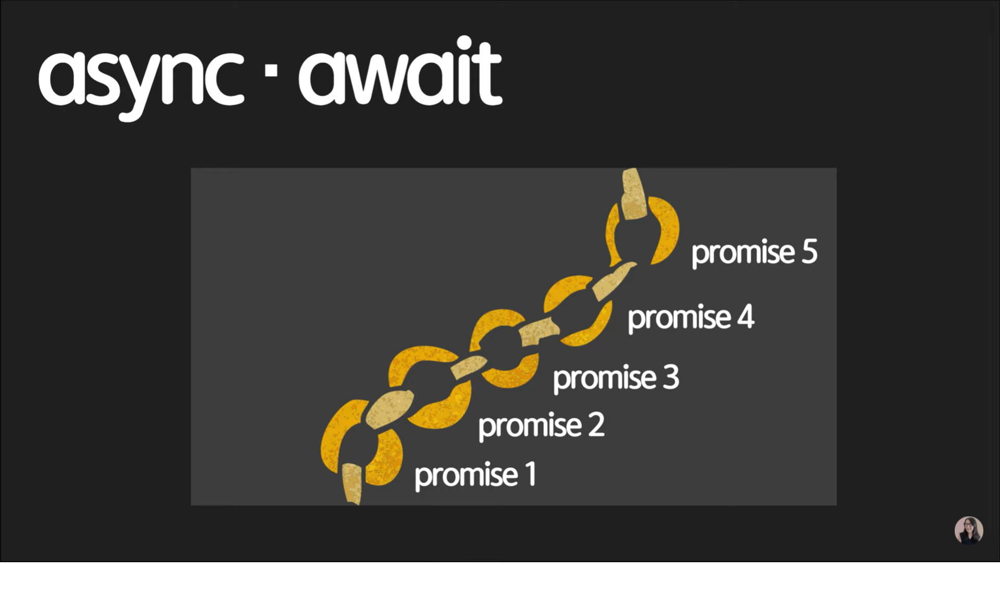
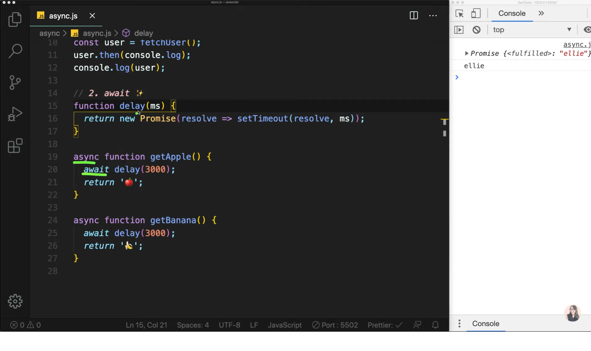
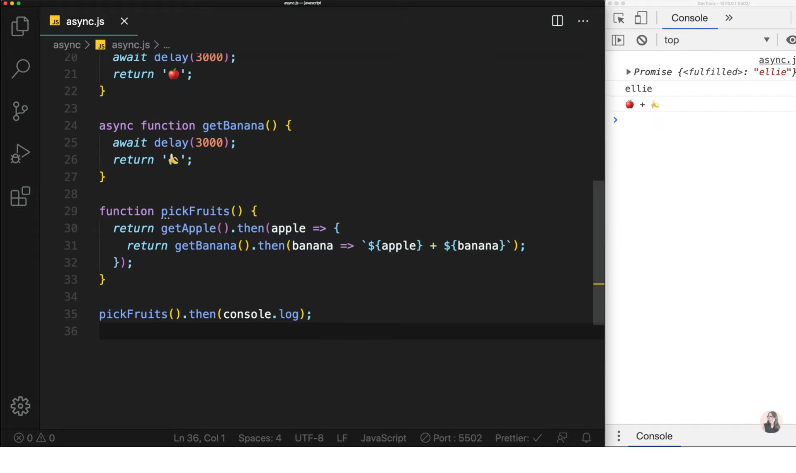

# Chapter 13

## 자바스크립트 13. 비동기의 꽃 JavaScript async 와 await 그리고 유용한 Promise APIs | 프론트엔드 개발자 입문편 (JavaScript ES6)

---

이번 챕터에서는 비동기 3번째 방식<br>
await + async 방식에 대해서 알아보겠습니다.<br>

<br><br>
async와 await는 지난 강의에서 다룬 Promise를 조금 더 간결하고 간편하고
그리고 조금 더 동기적으로 보이게 만들어주는 친구입니다.<br>
저번 강의에서 Promise를 여러 개 체인형식으로 묶을 수 있었는데
Promise마다 then을 여러 개 chaining을 하게 되면 코드가 난잡해줄 수 있습니다.<br>
async + await는 마치 동기식으로 순서대로 작성하는 것처럼 간편하게
작성할 수 있게 도와줍니다.<br>
Promise위에 조금 더 추가된 형식으로 간편한 api를 제공하는데
이것을 `syntactic sugar`라고 부릅니다.<br><br>

await + async는 promise 위에 덮혀진 'syntactic sugar'이지만<br>
그렇다고 해서 async + await만 쓰는 것이 아니라 때에 따라서 Promise를
유지해서 써야할 경우가 있으며 async await을 사용해야 더 깔끔해지는 경우도 있다.<br><br>

1. async

   ```
   function fetchUser() {
       // do network request in 10 seconds...
       return 'ellie';
   }

   const user = fetchUser();
   console.log(user);

   // 자바스크립트는 매우 똑똑한 녀석이라 동기적으로 실행이 되는데
   예를들어 위의 함수처럼 네트워크 요청을 10초동안 받아오는 함수가
   있다면 동기로 처리되기 때문에 fetchUser함수가 끝날때까지 기다려야
   하는 현상을 유발시킵니다.
   만약, 이 함수 뒤에 브라우저 UI를 나타내야 하는 중요한 코드들이
   기다리고 있다면 어떻게 될까요?
   브라우저는 fetchUser함수가 끝나길 기다리고 끝날때에서야
   비로소 다음 코드들이 실행되는 것을 알 수 있습니다.
   하나의 함수 때문에 모든 코드들이 실행될 수 없는 것이죠.
   이렇게 요청이 긴 함수들은 반드시 비동기로 빼둬야 합니다.
   ```

   ```
   저번 강의에서 이것을 이렇게 Promise로 해결할 수 있었습니다.
   function fetchUser() {
      // do network request in 10 seconds...
      return new Promise((resolve, reject) => {
          // do network request in 10 seconds...
             resolve('ellie');
      })
   }

   const user = fetchUser();
   user.then(console.log);
   console.log(user);
   ```

   ```
   이번 강의에서는 async 하나로 가볍게 해결하는 방법을 보여드리겠습니다.
   function fetchUser() {
       // do network request in 10 seconds...
       return 'ellie';
   }

   const user = fetchUser();
   user.then(console.log);
   console.log(user);
   // 이렇게 하면 자동적으로 함수 안에 있는 코드 블럭들이 자동적으로
   Promise로 변환이 됩니다.
   마치 async 한 단어면 귀찮게 Promise 작업을 해줬던 것들이 알아서
   생성해주는 것이다.
   // ㄹㅇ 갓갓

   ```

2. await

   <br><br>
   await는 async가 붙은 함수 안에서만 사용이 가능합니다.<br>
   위의 사진에서 delay함수는 return값으로 정해진 시간 후에 Promise객체를
   생성하고<br> resolve 콜백함수를 실행하는 함수입니다.<br>
   여기서 await는 delay가 3초가 끝날때까지 `기다려`줍니다.<br>
   원래는 기다리지 않고 동기식으로 바로 return하는 것 아시죠?<br>

   만약 getBanana 함수를 Promise로 만들게 되면

   ```
   function getBanana() {
       return delay(3000)
       .then(() => '🍌');
   }
   ```

   처럼 체이닝을 해줘야 됩니다.<br>
   즉, async await는 Promise에서 각각 Producer과 Consumer의 역할을 하고 있는 것이라고 할 수 있습니다.<br>
   어떤 방법이 좋아 보이시나요?<br><br>

   <br><br>
   이제 과일을 따는 함수를 만들고 과일을 한 번 수확해 보겠습니다.<br>
   return이 여러 번 사용되는 것이 보이시나요?<br>
   덕분에 Promise 체이닝도 여러번 하게 되었습니다.<br>
   이렇게 Promise도 체이닝을 여러번 하게 되면 마치 `콜백지옥`과 같이
   비슷한 문제점이 발생합니다.<br>
   우리는 이것을 async await로 간결하게 만들 수 있습니다.<br>

   ```
   async function pickFruits() {
       const apple = await getApple();
       const banana = await getBanana();
       return `${apple} + ${banana}`;
   }

   // 마치 동기식처럼 코드를 작성해도 비동기식으로 작동하며
   코드도 상당히 간결해지는 것을 볼 수 있습니다.
   만약 에러가 발생한다면 async await에서는 이렇게 처리할 수 있습니다.

   async function pickFruits() {
       try {
       const apple = await getApple();
       const banana = await getBanana();
       return `${apple} + ${banana}`;
       } catch {
       } finally {
       }
   }
   // Promise에서 then은 async await에서 try와 흡사하며
   catch와 finally는 async await에서 catch / finally와 똑같다.
   하지만 이 코드에도 문제점은 있는데 await로 getApple()함수를
   1초 기다리고 그 뒤에 getBanana()함수를 또 1초 기다린다는 것이다.
   둘은 별개이므로 사실 서로 기다려줄 필요가 없는데 말이다.
   위의 식을 해결하기 위해 아래처럼 코드를 짜볼 수도 있다.
   ```

   ```
   async function pickFruits() {
      const applePromise = getApple();
      const bananaPromise = getBanana();
      const apple = await getApple();
      const banana = await getBanana();
      return `${apple} + ${banana}`;
   }
   // 이렇게 하면 애플 함수와 바나나함수가 동시에 실행되고
   실행되자마자 Promise객체를 생성하기 때문에
   마치 병렬적으로 실행되게 됩니다.
   그런데 사실 이렇게 동시다발적으로 병렬적으로 실행되는 경우에는
   이렇게 사용하지 않고 밑의 코드처럼 아주 좋은 Promise api를
   사용하게 됩니다.
   ```

3. useful APIs

   ```
   function pickAllFruits() {
       return Promise.all([getApple(), getBanana()]).then(
           fruits => fruits.join(' + ');
       )
   }
   pickAllFruits.then(console.log);

   // 이것은 Promise 배열을 전달하게 되면 모든 Promise들을
   병렬적으로 다 받을때까지 모아주는 역할을 합니다.
   ```

   ```
   function pickAllFruits() {
       return Promise.race([getApple(), getBanana()]).then(
           fruits => fruits.join(' + ');
       )
   }
   pickAllFruits.then(console.log);
   // 이것은 Promise 배열 중 가장빨리 실행되는 하나의 Promise만
   받습니다.
   ```

이번 강의는 여기서 마무리입니다 :)<br><br>
이 글은 [유튜브 드림코딩 by 엘리 채널](https://www.youtube.com/watch?v=aoQSOZfz3vQ&list=PLv2d7VI9OotTVOL4QmPfvJWPJvkmv6h-2&index=13)을 통해 리뷰를 작성한 것이며 어떠한 상업적 목적으로도 사용되지 않았습니다. 추후 문제가 되는 점을 발견하시면 댓글을 통해 남겨주시는대로 수정하겠습니다 :)
